# Тема 2. Базовые операции языка Python  
**ФИО:** Зейн Талеб Шейхна  
**Группа:** ИВТ-23-1  

## Итоговая таблица

| Задание   | Лаб_раб | Сам_раб |
|-----------|:-------:|:-------:|
| Задание 1 |    +    |    +    |
| Задание 2 |    +    |    +    |
| Задание 3 |    +    |    +    |
| Задание 4 |    +    |    +    |
| Задание 5 |    +    |    +    |
| Задание 6 |    +    |    +    |
| Задание 7 |    +    |    +    |
| Задание 8 |    +    |    +    |
| Задание 9 |    +    |    +    |
| Задание 10|    +    |    +    |

Знак "+" – задание выполнено; знак "-" – задание не выполнено.
# Лабораторная работа 2 и Самостоятельная работа 2

## 📘 Лабораторная работа 2

### Задание 1
**Скриншот результата:**  
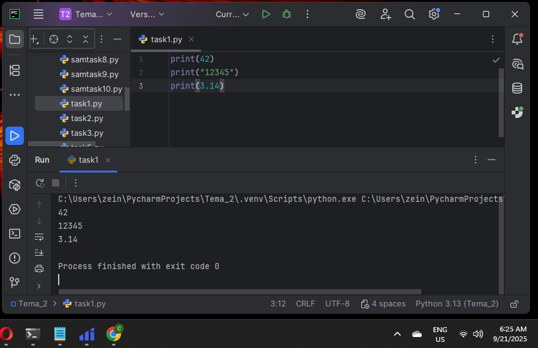  

**Вывод:** Вывел три строки: число, число в виде строки и число с плавающей точкой.

---

### Задание 2
**Скриншот результата:**  
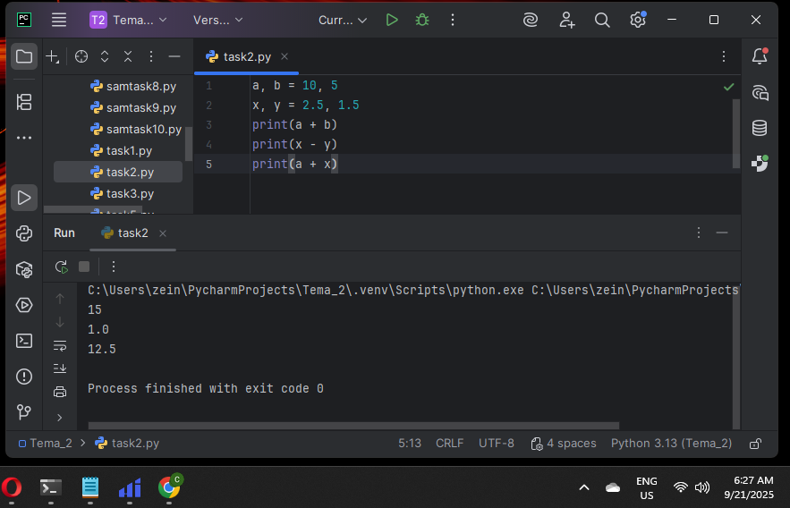  

**Вывод:** Получил результат сложения int, float и их комбинации.

---

### Задание 3
**Скриншот результата:**  
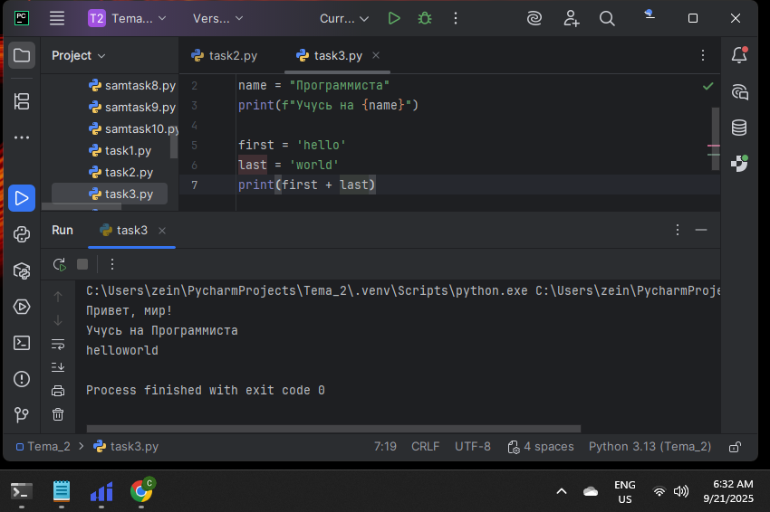  

**Вывод:** Вывел обычную строку, f-строку с переменной и результат конкатенации строк.

---

### Задание 4
**Скриншот результата:**  
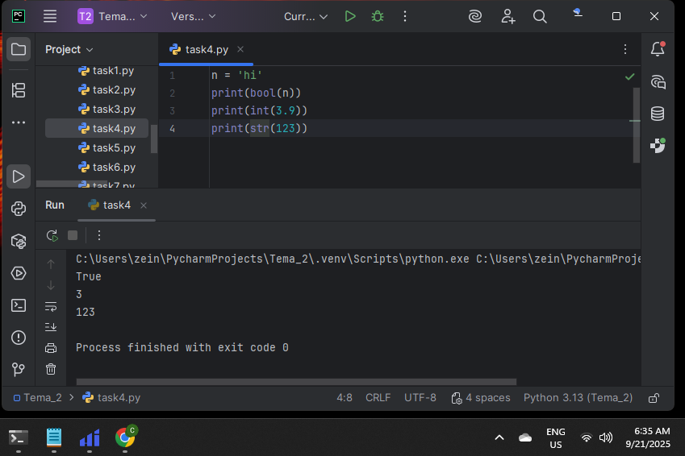  

**Вывод:** Преобразовал переменные в bool, int/float и str.

---

### Задание 5
**Скриншот результата:**  
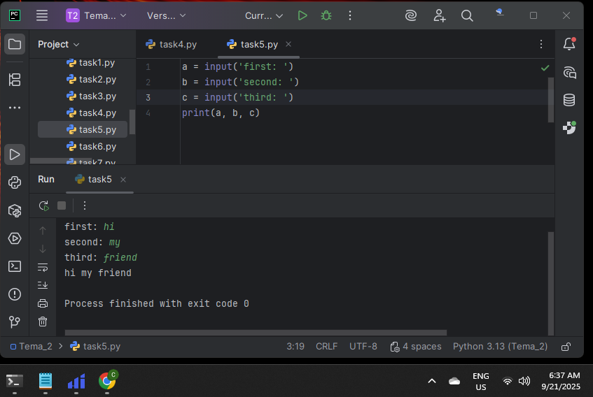  

**Вывод:** Ввел три значения через input() и присвоил их переменным.

---

### Задание 6
**Скриншот результата:**  
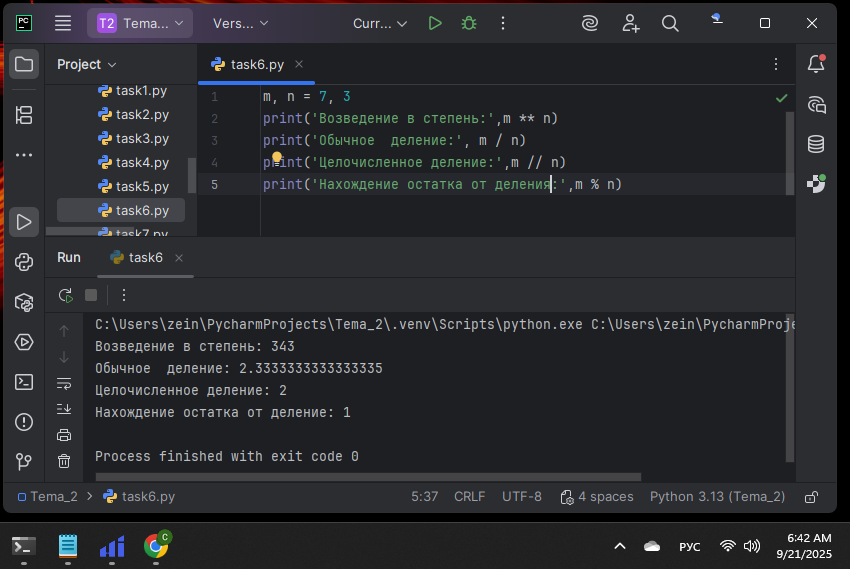  

**Вывод:** Выполнил возведение в степень, деление, целочисленное деление и остаток от деления.

---

### Задание 7
**Скриншот результата:**  
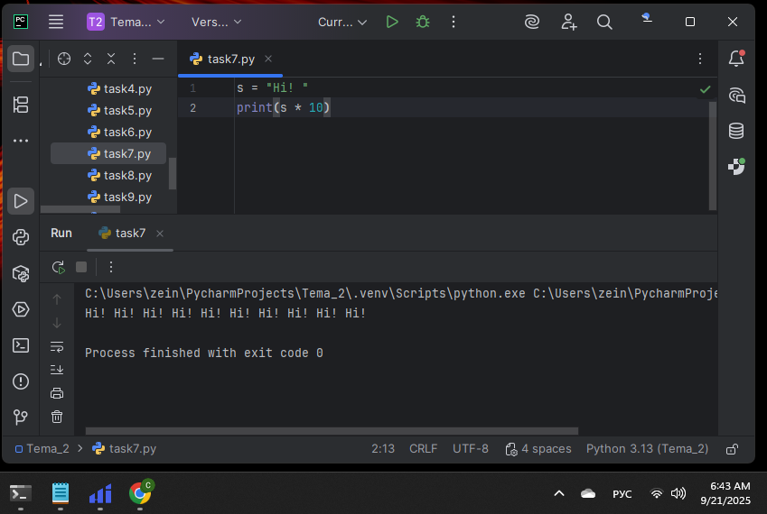  

**Вывод:** Умножил строковую переменную на число и получил повторение строки.

---

### Задание 8
**Скриншот результата:**  
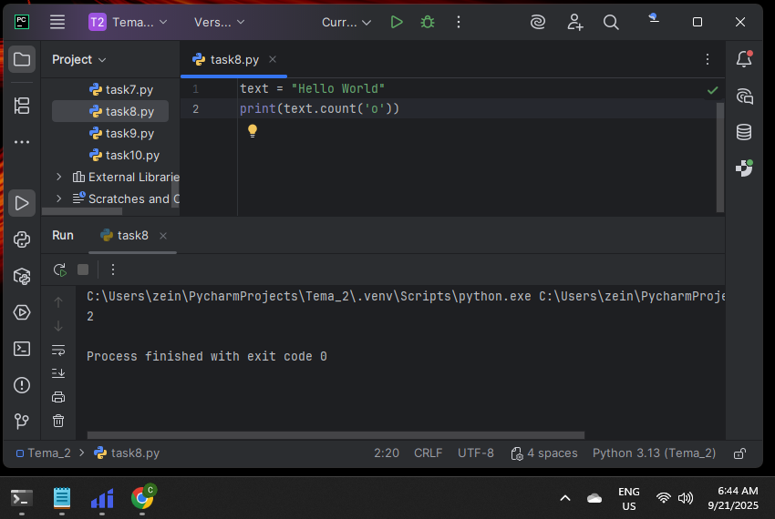  

**Вывод:** Посчитал количество символов `o` в строке "Hello World".

---

### Задание 9
**Скриншот результата:**  
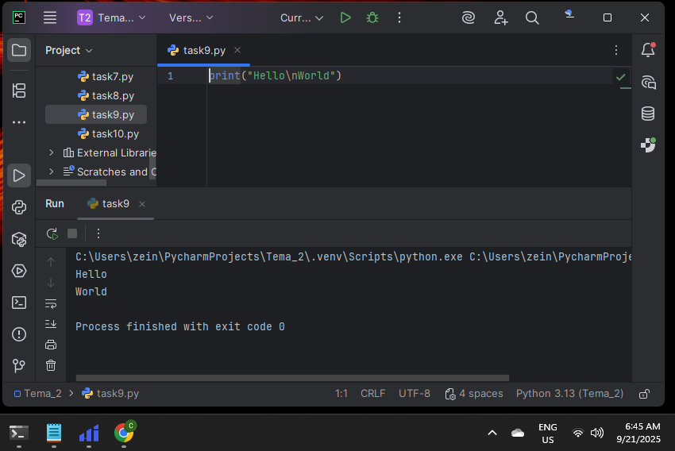  

**Вывод:** Вывел строку "Hello World" в две строки, используя одну строку кода.

---

### Задание 10
**Скриншот результата:**  
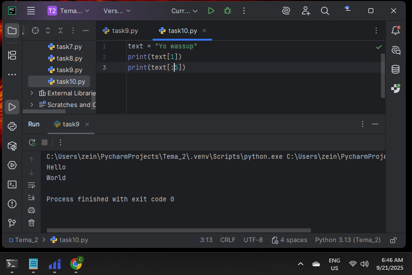  

**Вывод:** Вывел второй символ строки "Hello World" и слово "Hello".

---

## 📗 Самостоятельная работа 2

### Задание 1
**Скриншот результата:**  
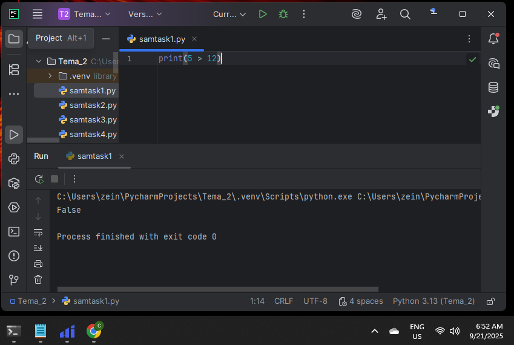  

**Вывод:** Получил False без использования слова `False`.

---

### Задание 2
**Скриншот результата:**  
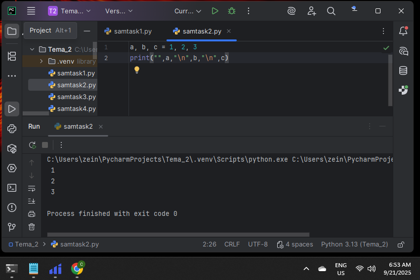  

**Вывод:** Присвоил значения трём переменным и вывел их в консоль за две строки.

---

### Задание 3
**Скриншот результата:**  
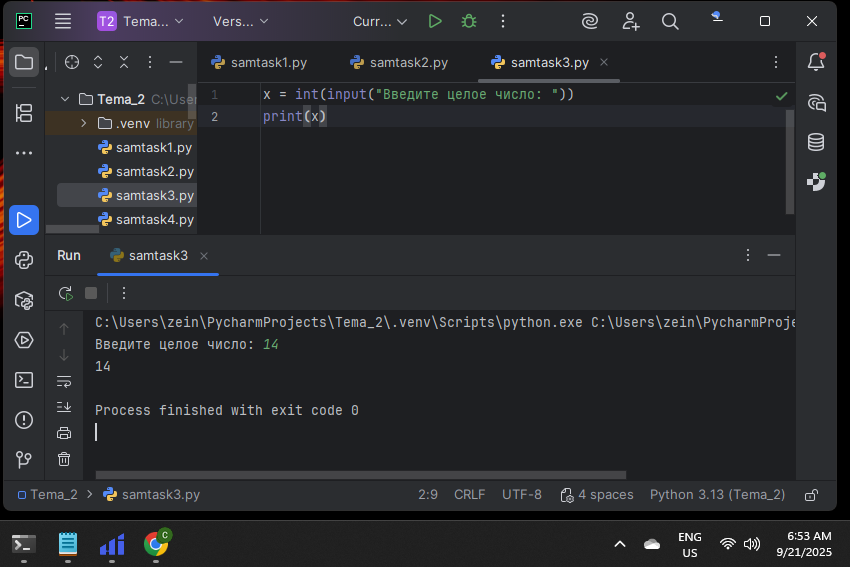  

**Вывод:** Реализовал ввод только целых чисел через `int(input())`.

---

### Задание 4
**Скриншот результата:**  
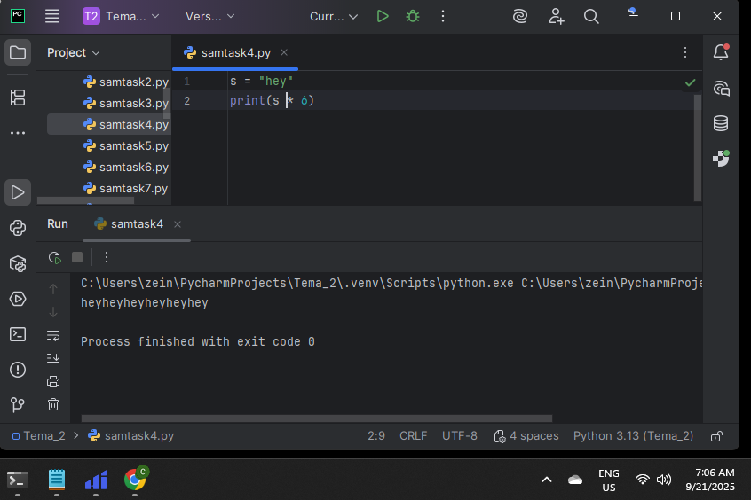  

**Вывод:** Создал строку ≤ 5 символов и получил строку длиной ≥ 16 символов.

---

### Задание 5
**Скриншот результата:**  
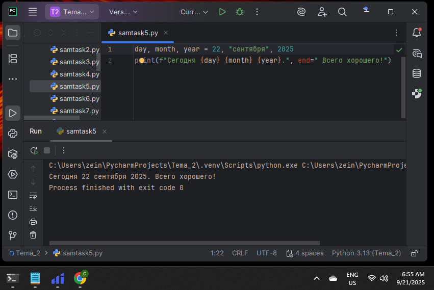  

**Вывод:** Вывел дату в формате "Сегодня день месяц год. Всего хорошего!" с помощью f-строки.

---

### Задание 6
**Скриншот результата:**  
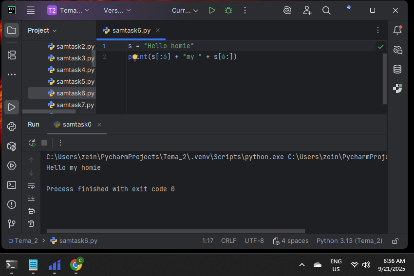  

**Вывод:** Вставил "my" в строку "Hello World" между словами.

---

### Задание 7
**Скриншот результата:**  
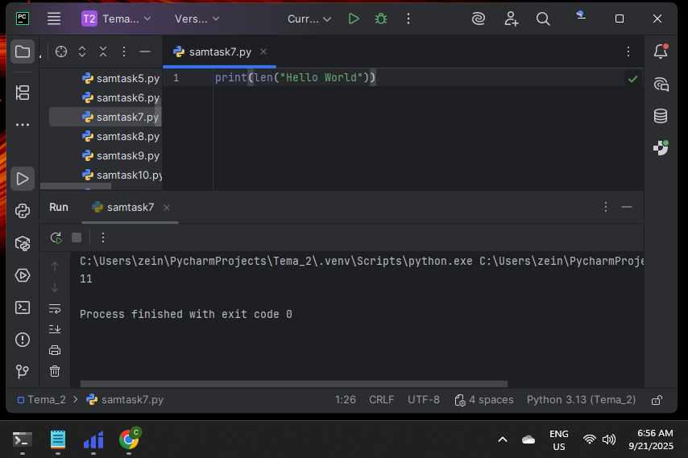  

**Вывод:** Определил длину строки "Hello World".

---

### Задание 8
**Скриншот результата:**  
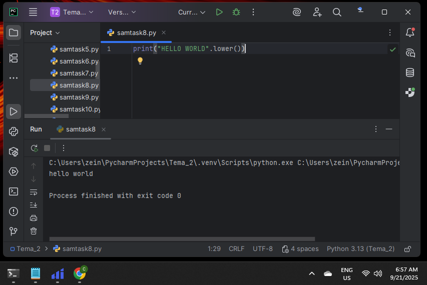  

**Вывод:** Преобразовал строку "HELLO WORLD" в нижний регистр.

---

### Задание 9
**Скриншот результата:**  
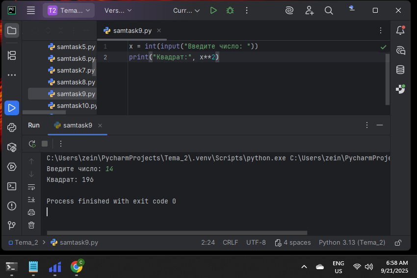  

**Вывод:** Решил задачу с числами (например, вычислил квадрат числа).

---

### Задание 10
**Скриншот результата:**  
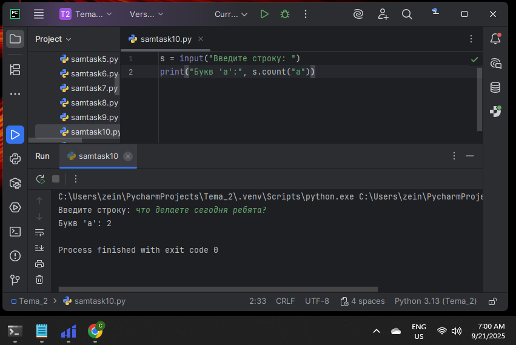  

**Вывод:** Решил задачу со строками (например, подсчитал количество букв "а" в строке).