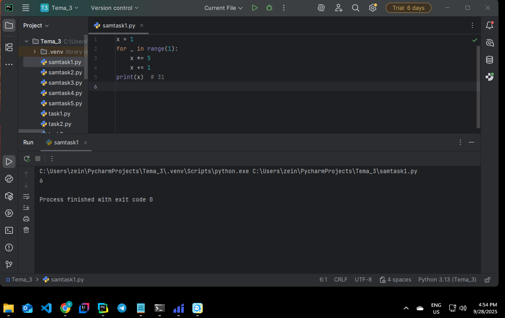
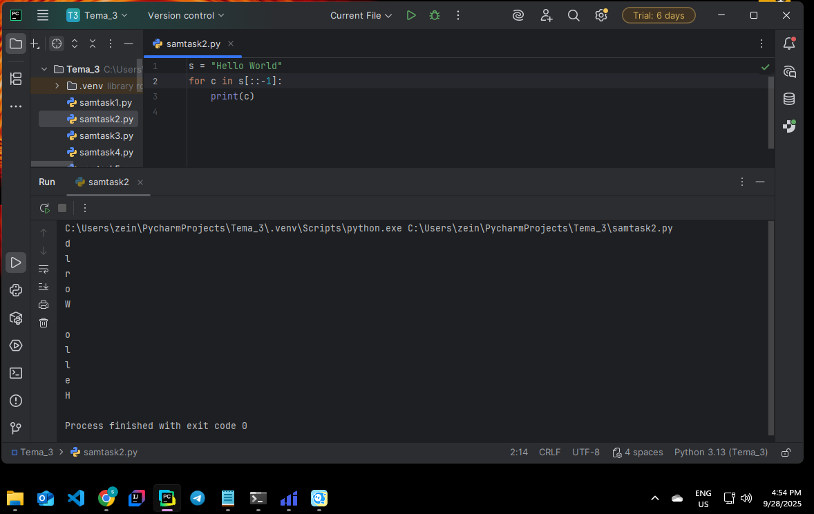
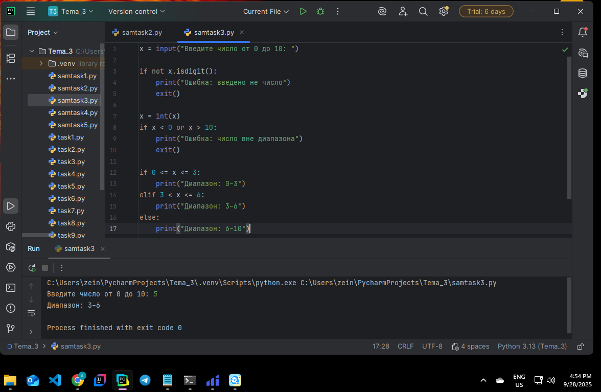
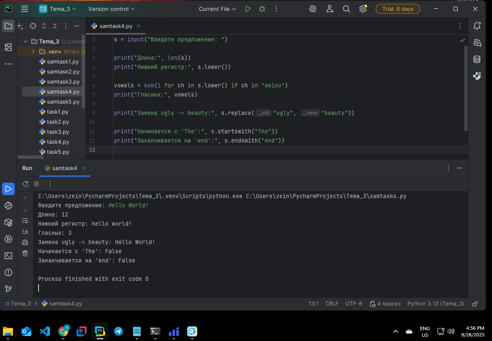
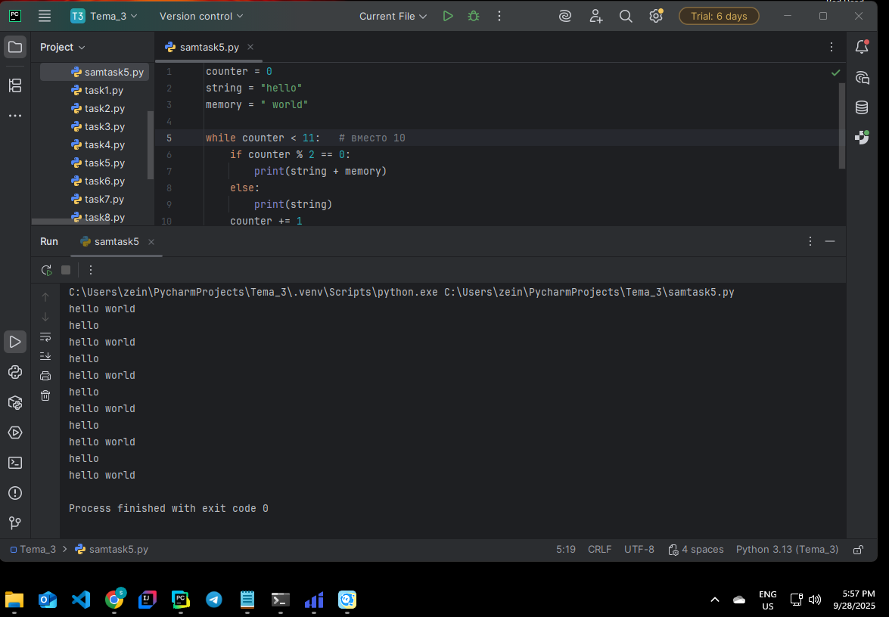

# Тема 3. Операторы, условия, циклы  
**ФИО:** Зейн Талеб Шейхна  
**Группа:** ИВТ-23-1  

## Итоговая таблица

| Задание   | Лаб_раб | Сам_раб |
|-----------|:-------:|:-------:|
| Задание 1 |    +    |    +    |
| Задание 2 |    +    |    +    |
| Задание 3 |    +    |    +    |
| Задание 4 |    +    |    +    |
| Задание 5 |    +    |    +    |
| Задание 6 |    +    |    -    |
| Задание 7 |    +    |    -    |
| Задание 8 |    +    |    -    |
| Задание 9 |    +    |    -    |
| Задание 10|    +    |    -    |

Знак "+" – задание выполнено; знак "-" – задание не выполнено.  

# Лабораторная работа 3 и Самостоятельная работа 3

## 📘 Лабораторная работа 3

### Задание 1
**Скриншот результата:**  
  

**Вывод:** Сравнил две переменные, ввёл через консоль, вывел результат выполнения условия.

---

### Задание 2
**Скриншот результата:**  
  

**Вывод:** Определил диапазон значения переменной (меньше 0, от 0 до 10, больше 10).

---

### Задание 3
**Скриншот результата:**  
  

**Вывод:** Проверил наличие переменной в массиве с помощью оператора in.

---

### Задание 4
**Скриншот результата:**  
  

**Вывод:** Если значение есть в массиве, программа определила, чётное оно или нечётное.

---

### Задание 5
**Скриншот результата:**  
  

**Вывод:** С помощью цикла for перебрал значения от 0 до 10 и протестировал разные сравнения.

---

### Задание 6
**Скриншот результата:**  
  

**Вывод:** Реализовал поиск значения в строке через цикл for и оператор else.

---

### Задание 7
**Скриншот результата:**  
  

**Вывод:** Реализовал цикл в обратном порядке (от 10 до 0) и применил своё вычисление.

---

### Задание 8
**Скриншот результата:**  
  

**Вывод:** Написал цикл while с условием, чтобы избежать бесконечного выполнения.

---

### Задание 9
**Скриншот результата:**  
  

**Вывод:** Использовал вложенные циклы с разными итерируемыми переменными и проверкой внутри.

---

### Задание 10
**Скриншот результата:**  
  

**Вывод:** Применил flag для проверки наличия нечётного числа в массиве.

---

## 📗 Самостоятельная работа 3

### Задание 1
**Скриншот результата:**  
  

**Вывод:** С помощью цикла for, операций *=5 и +=1 преобразовал число 1 в 31.

---

### Задание 2
**Скриншот результата:**  
  

**Вывод:** Вывел строку "Hello World" в обратном порядке, каждая буква с новой строки, ≤3 строк кода.

---

### Задание 3
**Скриншот результата:**  
  

**Вывод:** Программа принимает число от 0 до 10 и определяет, в каком диапазоне оно находится.

---

### Задание 4
**Скриншот результата:**  
  

**Вывод:** Выполнил операции со строкой: длина, lowercase, подсчёт гласных, замена "ugly" → "beauty", проверка начала/конца.

---

### Задание 5
**Скриншот результата:**  
  

**Вывод:** Составил программу из предложенных фрагментов кода и получил нужный вывод.

---

## Общий вывод

В ходе выполнения лабораторных и самостоятельных заданий по теме 3 я закрепил навыки работы с операторами, условиями и циклами в Python. Я научился:

- сравнивать значения и работать с логическими условиями;
- использовать циклы for и while, включая вложенные и обратные варианты;
- применять оператор in, else для циклов и флаговые переменные;
- обрабатывать строки: менять регистр, заменять слова, считать символы;
- контролировать диапазоны чисел и корректность пользовательского ввода.

Эти задания позволили глубже понять использование условий и циклов в Python и подготовили к более сложным практическим задачам.
