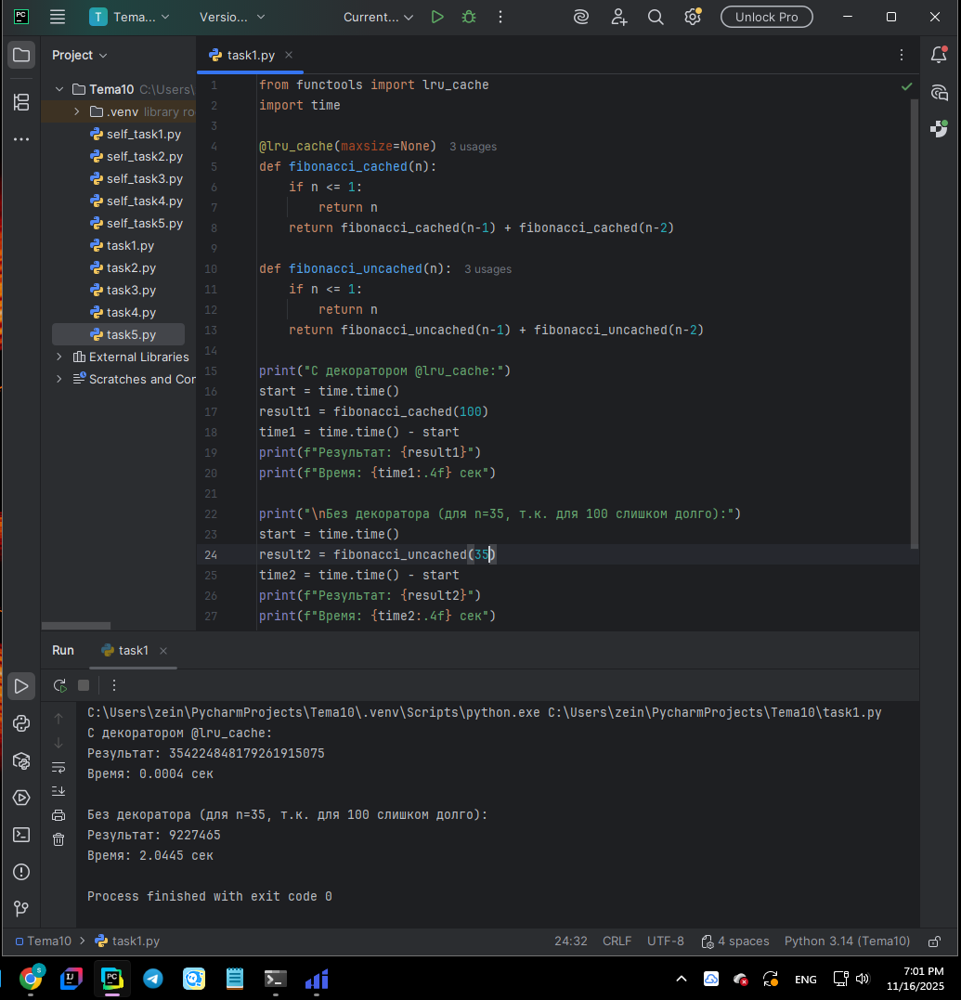
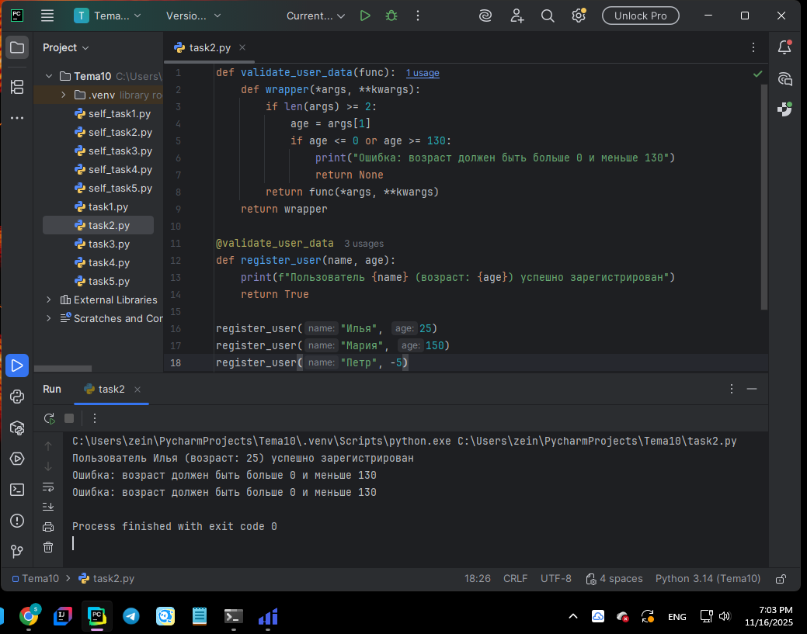
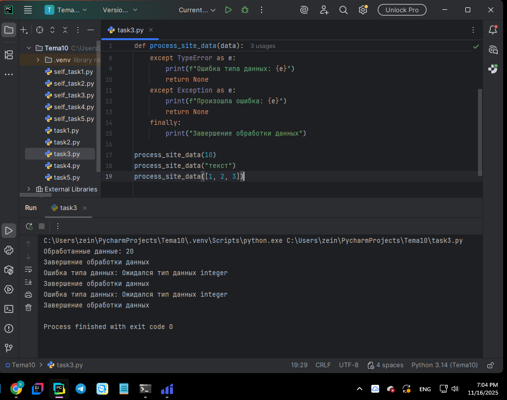
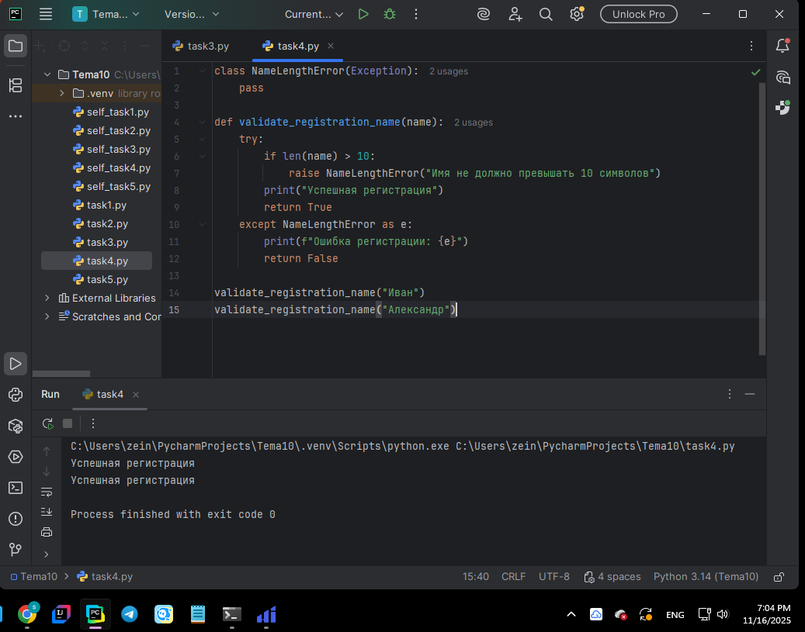
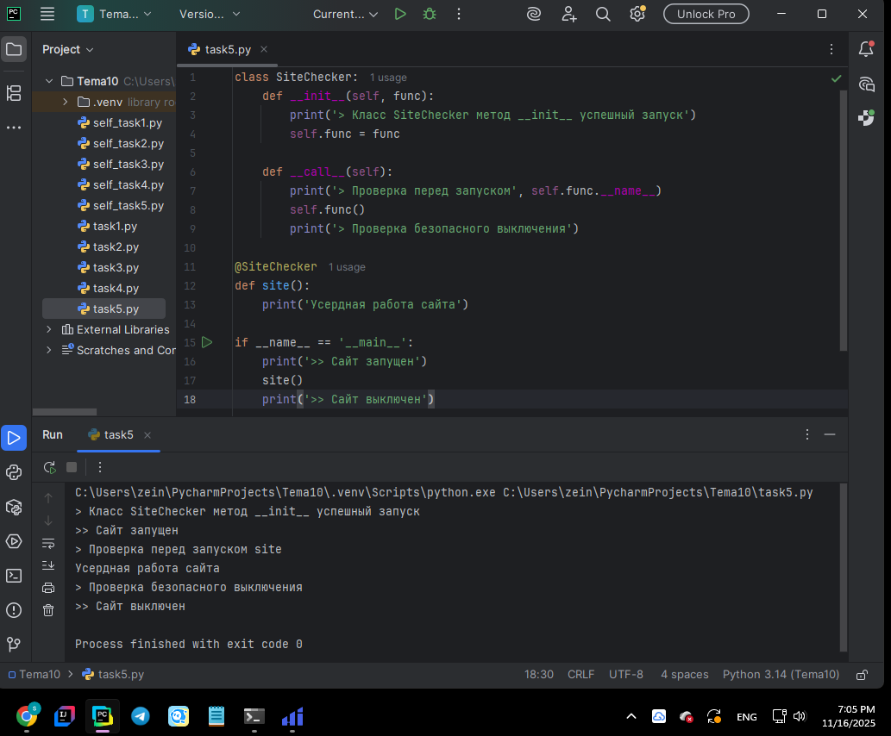
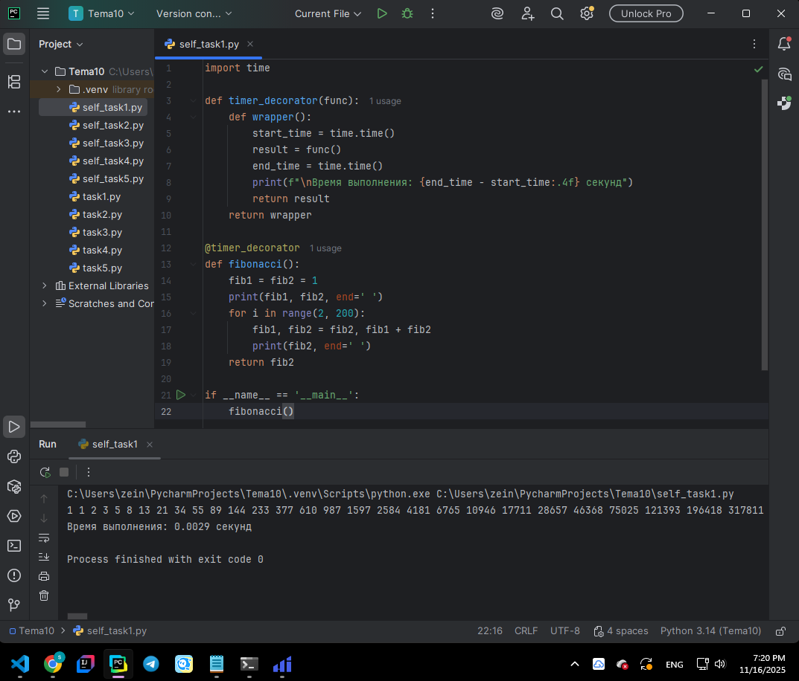
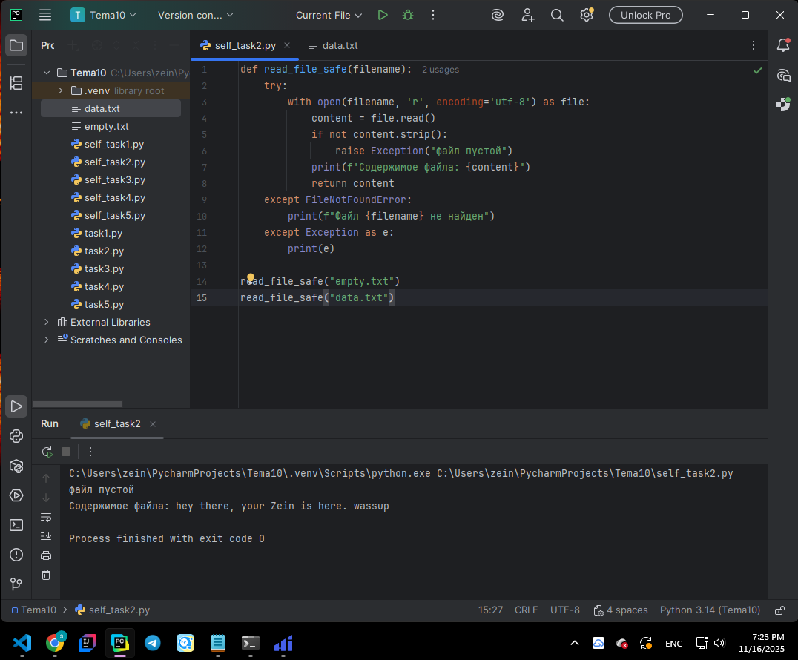
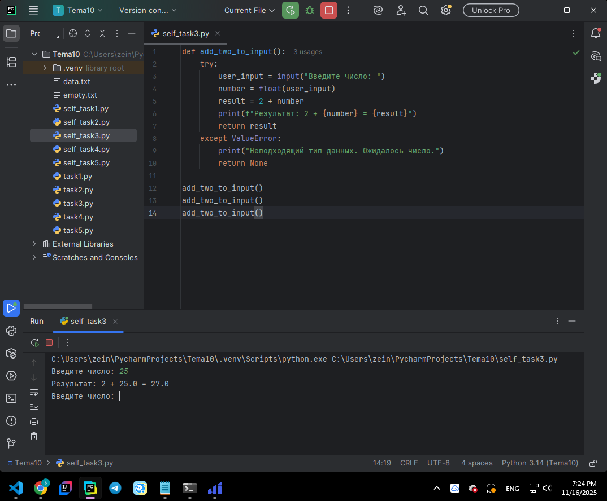
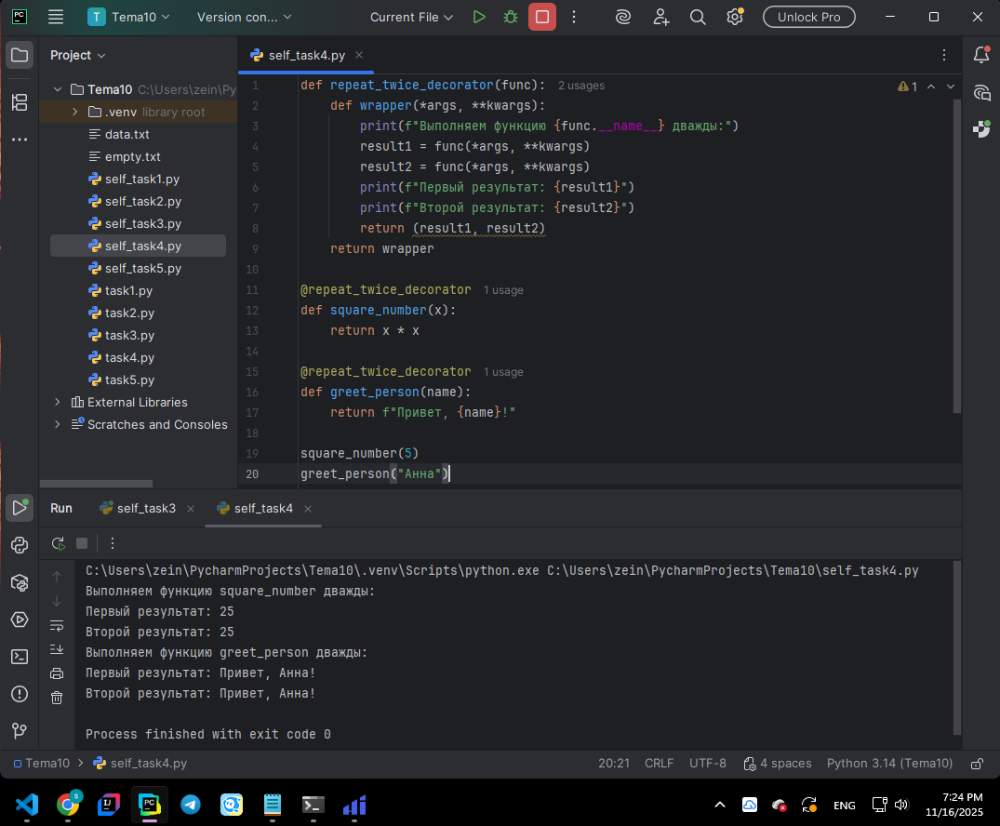
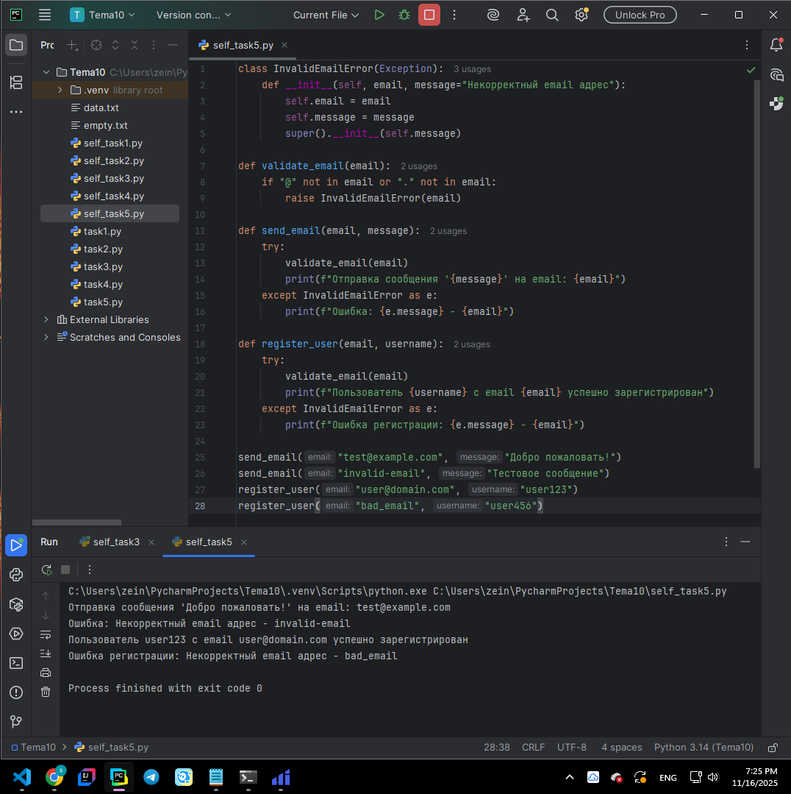

# Тема 10. Декораторы и исключения
**ФИО:** Зейн Талеб Шейхна
**Группа:** ИВТ-23-1

## Итоговая таблица

| Задание   | Лаб_раб | Сам_раб |
|-----------|:-------:|:-------:|
| Задание 1 |    +    |    +    |
| Задание 2 |    +    |    +    |
| Задание 3 |    +    |    +    |
| Задание 4 |    +    |    +    |
| Задание 5 |    +    |    +    |

Знак «+» – задание выполнено; знак «–» – задание не выполнено.

---

# 📘 Лабораторная работа 10

### Задание 1: Декоратор @lru_cache для чисел Фибоначчи
**Скриншот:** 
  

**Вывод:** Создал функцию для вычисления чисел Фибоначчи с использованием рекурсии. Продемонстрировал разницу во времени выполнения с декоратором `@lru_cache` и без него. Декоратор значительно ускоряет выполнение за счет кэширования промежуточных результатов.

### Задание 2: Декоратор проверки возраста
**Скриншот:** 
  

**Вывод:** Реализовал декоратор `validate_age`, который проверяет корректность возраста пользователя. При недопустимом значении возраста выводится сообщение об ошибке, и функция не выполняется.

### Задание 3: Обработка исключений для типа данных
**Скриншот:** 
  

**Вывод:** Написал функцию `process_data` с обработкой исключений. При передаче неподходящего типа данных выводится сообщение об ошибке, а блок `finally` гарантирует завершение операции.

### Задание 4: Пользовательское исключение для длины имени
**Скриншот:** 
  

**Вывод:** Создал пользовательское исключение `NameTooLongError`. Реализовал функцию проверки длины имени, которая вызывает исключение при превышении лимита символов.

### Задание 5: Декоратор-логгер
**Скриншот:** 
  

**Вывод:** Разработал класс-декоратор `SiteLogger` с методами `__init__` и `__call__`. Декоратор логирует этапы работы функции и обеспечивает безопасное выполнение.

---

# 📗 Самостоятельная работа 10

### Задание 1: Декоратор измерения времени выполнения
**Скриншот:** 
  

**Вывод:** Создал декоратор `timer_decorator` для измерения времени выполнения функции. Применил его к функции вычисления чисел Фибоначчи, показав эффективность итеративного подхода по сравнению с рекурсивным.

### Задание 2: Обработка исключений для пустого файла
**Скриншот:** 
  

**Вывод:** Реализовал функцию чтения файла с обработкой исключений. При пустом файле вызывается исключение с соответствующим сообщением.

### Задание 3: Функция сложения с обработкой исключений
**Скриншот:**
   

**Вывод:** Написал функцию `add_two`, которая обрабатывает исключения при вводе неподходящего типа данных. Провел тесты с корректными и некорректными данными.

### Задание 4: Пользовательский декоратор для логирования
**Скриншот:** 
  

**Вывод:** Создал декоратор `debug_decorator` для логирования вызовов функций. Продемонстрировал его работу на двух различных функциях с разными аргументами.

### Задание 5: Пользовательское исключение для отрицательного баланса
**Скриншот:** 
 

**Вывод:** Разработал пользовательское исключение `NegativeBalanceError` и применил его в классе `BankAccount` для проверки отрицательного баланса при создании счета и снятии средств.

---

## Общий вывод

В ходе выполнения лабораторной работы по теме 10 я освоил работу с декораторами и исключениями в Python:

- **Декораторы**: научился создавать функции-обертки для измерения времени выполнения, валидации данных и логирования
- **Исключения**: изучил обработку стандартных исключений (TypeError, ValueError) и создание пользовательских исключений
- **Практическое применение**: реализовал полезные инструменты для отладки и защиты программ от ошибок
- **Модуль time**: использовал для измерения производительности функций

Полученные навыки позволяют создавать более надежный и отлаживаемый код, что особенно важно при разработке сложных приложений.