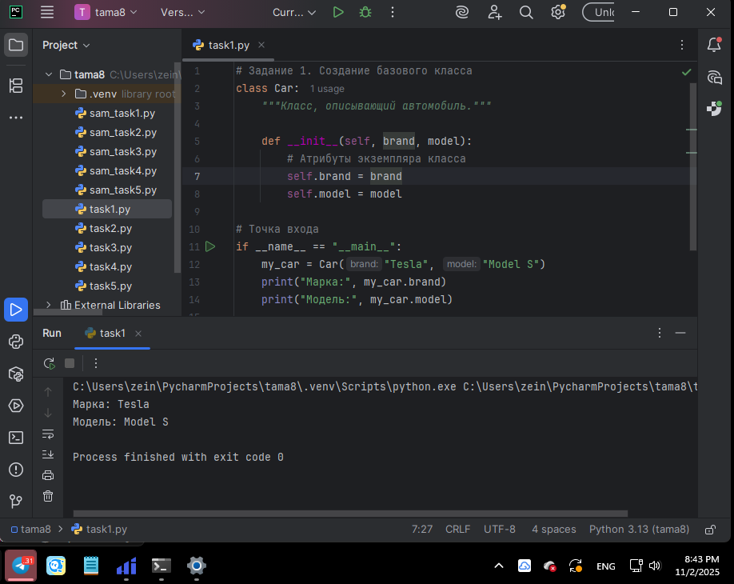
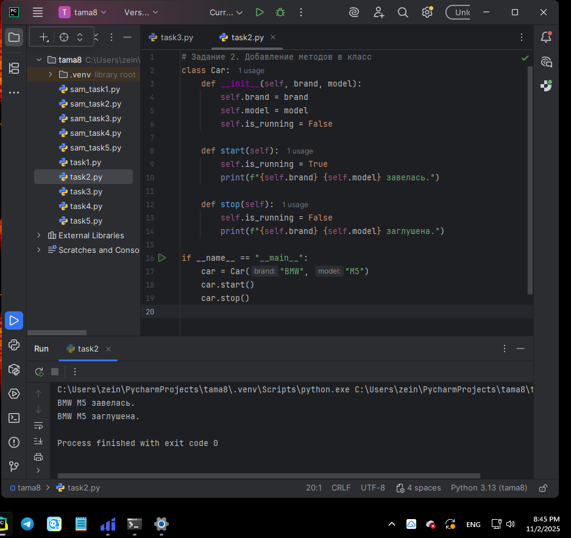
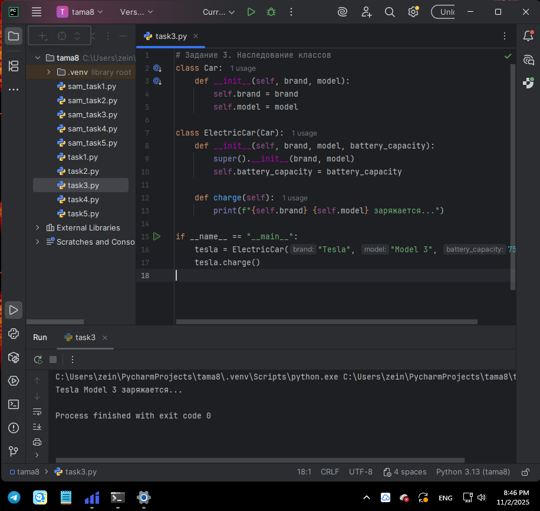
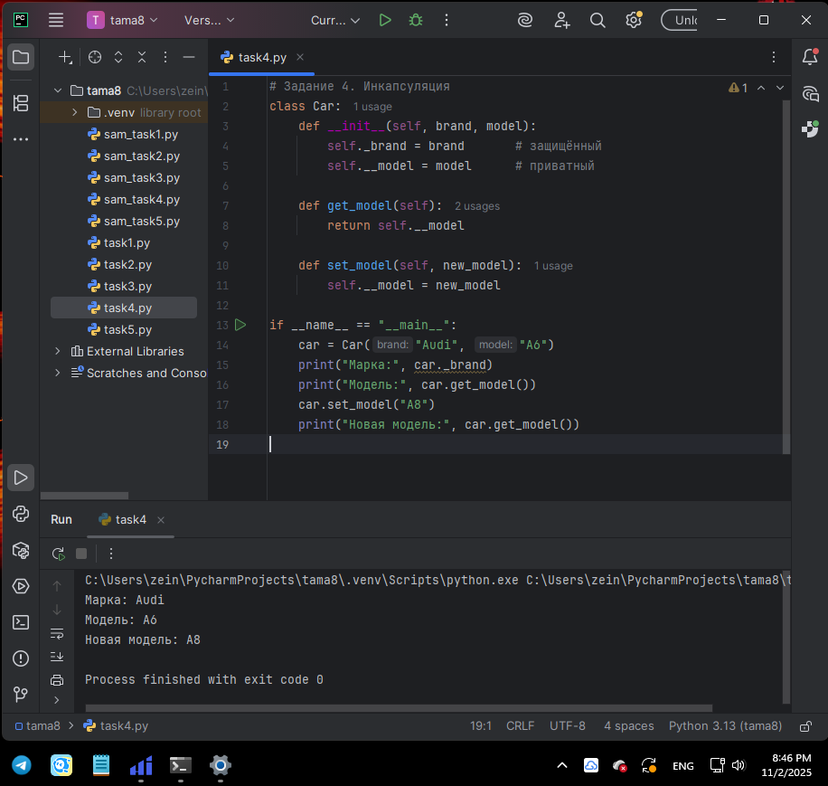
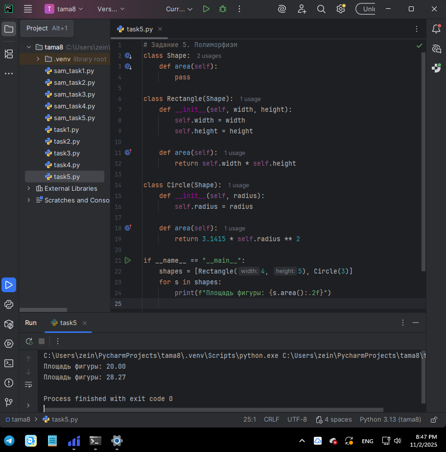
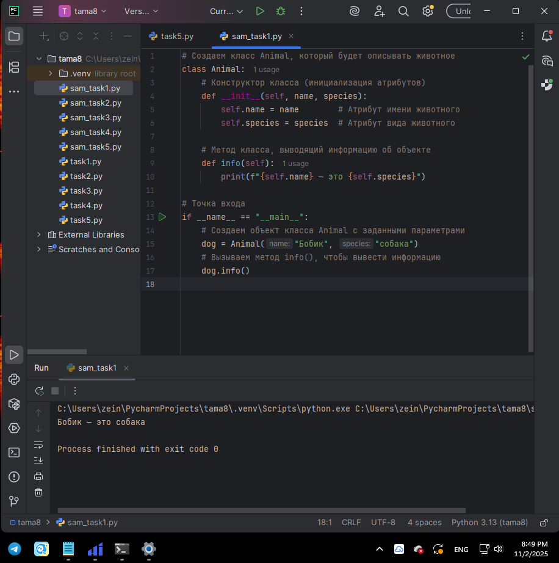
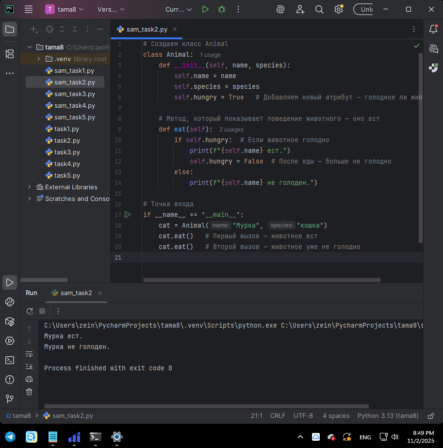
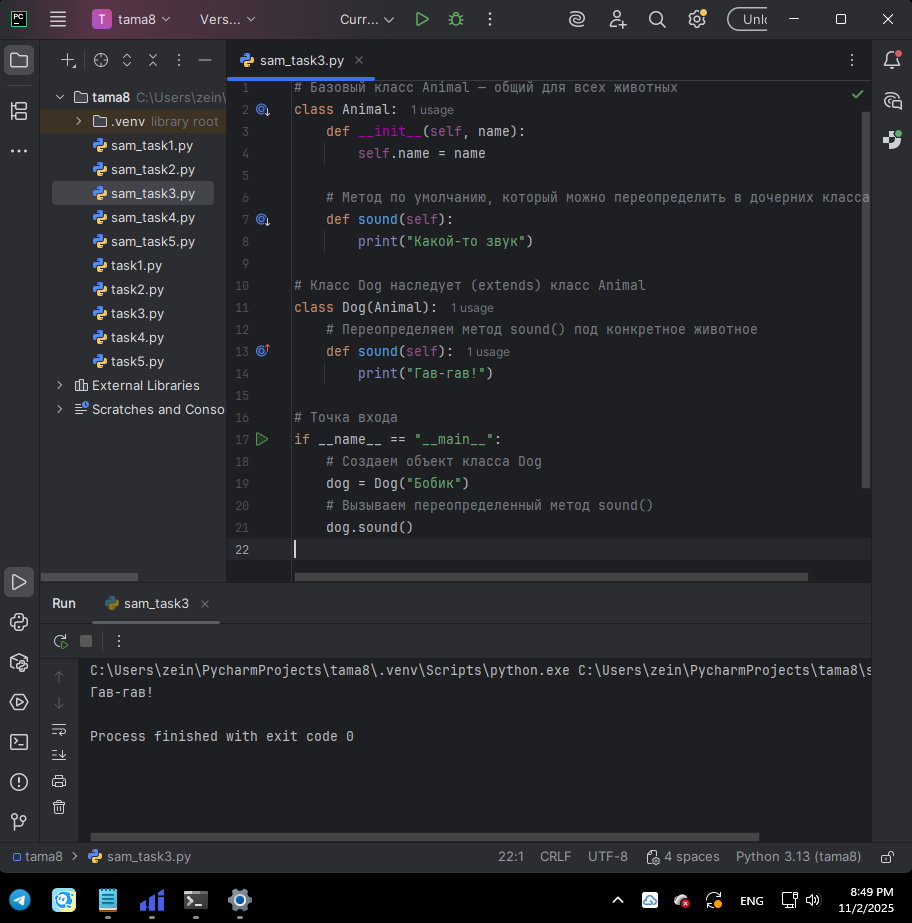
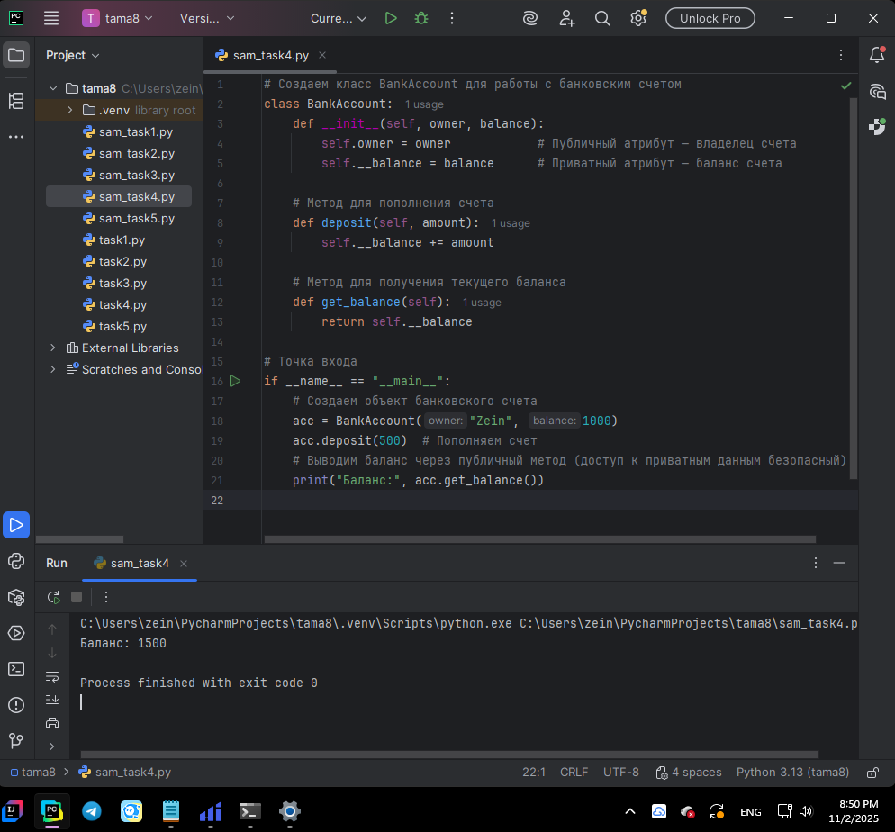
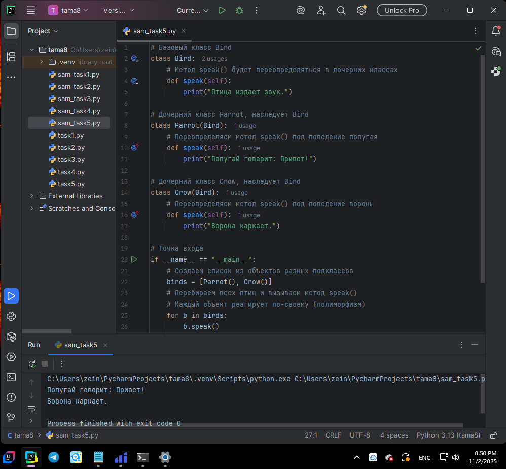

# Тема 8. Введение в ООП  
**ФИО:** Зейн Талеб Шейхна  
**Группа:** ИВТ-23-1  

## Итоговая таблица  

| Задание   | Лаб_раб | Сам_раб |
|-----------|:-------:|:-------:|
| Задание 1 |    +    |    +    |
| Задание 2 |    +    |    +    |
| Задание 3 |    +    |    +    |
| Задание 4 |    +    |    +    |
| Задание 5 |    +    |    +    |

Знак "+" – задание выполнено; знак "–" – не выполнено.  

---

# 📘 Лабораторная работа 8  

### Задание 1  
**Скриншот результата:**  
  
**Вывод:** Создал класс `Car` с атрибутами производителя и модели. Добавил комментарии, объясняющие работу кода.  

---

### Задание 2  
**Скриншот результата:**  
  
**Вывод:** Добавил методы и атрибуты для класса `Car`, чтобы машина «поехала». Продемонстрировал вызов методов и обновление атрибутов.  

---

### Задание 3  
**Скриншот результата:**  
  
**Вывод:** Создал класс `ElectricCar`, унаследовал его от `Car`. Добавил метод `charge` и атрибут ёмкости батареи, реализовав наследование.  

---

### Задание 4  
**Скриншот результата:**  
  
**Вывод:** Реализовал инкапсуляцию: добавил защищённый атрибут производителя и приватный атрибут модели. Доступ к ним организовал через методы.  

---

### Задание 5  
**Скриншот результата:**  
  
**Вывод:** Продемонстрировал полиморфизм на примере базового класса `Shape` и дочерних `Rectangle` и `Circle`, вычислив площадь фигур в цикле.  

---

# 📗 Самостоятельная работа 8  

### Задание 1  
**Скриншот результата:**  
  
**Вывод:** Создал собственный класс и объект, отличающийся от примеров из методички и лабораторной работы.  

---

### Задание 2  
**Скриншот результата:**  
  
**Вывод:** Добавил собственные атрибуты и методы в созданный класс, обеспечив новое поведение объектов.  

---

### Задание 3  
**Скриншот результата:**  
  
**Вывод:** Реализовал наследование для ранее созданного класса, создав подкласс с дополнительными функциями.  

---

### Задание 4  
**Скриншот результата:**  
  
**Вывод:** Применил инкапсуляцию в пользовательском классе, ограничив доступ к внутренним атрибутам.  

---

### Задание 5  
**Скриншот результата:**  
  
**Вывод:** Реализовал полиморфизм в собственных классах, переопределяя методы и демонстрируя их универсальность.  

---

## Общий вывод  

В ходе выполнения лабораторных и самостоятельных заданий по теме 8 я освоил основы объектно-ориентированного программирования в Python. Я научился:  

- создавать классы и объекты;  
- добавлять атрибуты и методы для описания поведения объектов;  
- использовать наследование для расширения функциональности;  
- применять инкапсуляцию для защиты данных;  
- демонстрировать полиморфизм в практических примерах.  

Эта тема позволила понять основные принципы ООП и подготовила к созданию структурированных и масштабируемых программ.  
