# Тема 6. Базовые коллекции: словари и кортежи  
**ФИО:** Зейн Талеб Шейхна  
**Группа:** ИВТ-23-1  

## Итоговая таблица  

| Задание   | Лаб_раб | Сам_раб |
|-----------|:-------:|:-------:|
| Задание 1 |    +    |    +    |
| Задание 2 |    +    |    +    |
| Задание 3 |    +    |    +    |
| Задание 4 |    +    |    +    |
| Задание 5 |    +    |    +    |

Знак "+" – задание выполнено; знак "-" – задание не выполнено.  

# Лабораторная работа 6 и Самостоятельная работа 6  

## 📘 Лабораторная работа 6  

### Задание 1  
**Скриншот результата:**  
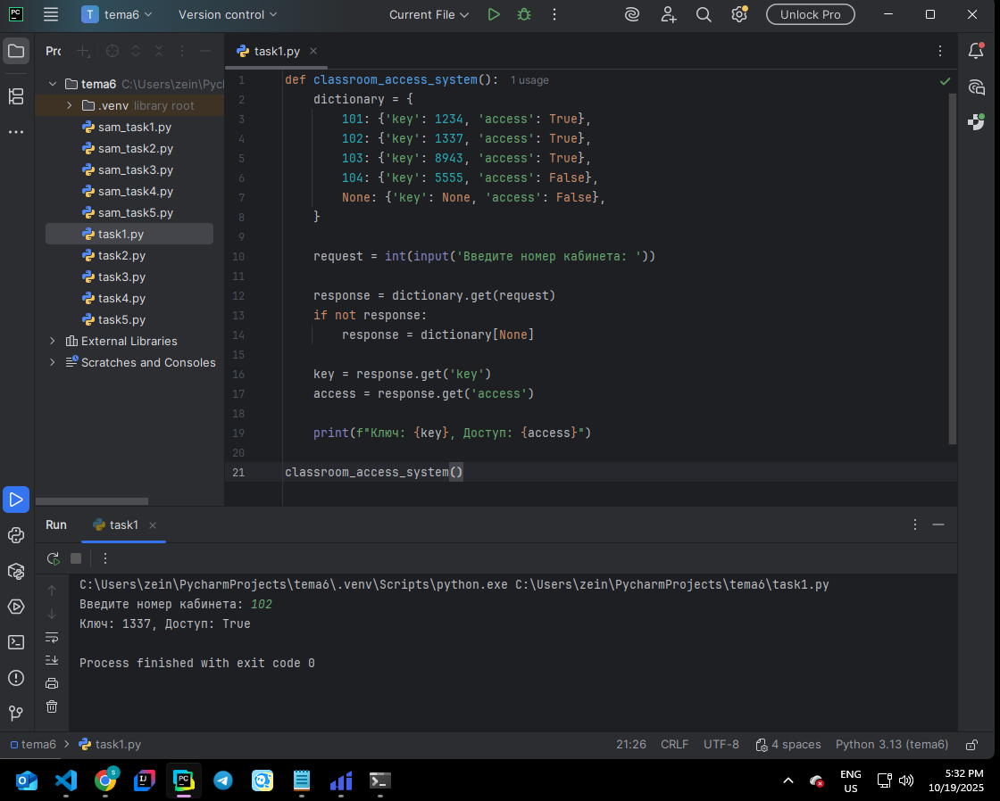  

**Вывод:** Создал словарь, где ключом является номер кабинета, а значением — кортеж из ключа доступа и статуса. При отсутствии кабинета программа возвращает `None` и `False`.  

---

### Задание 2  
**Скриншот результата:**  
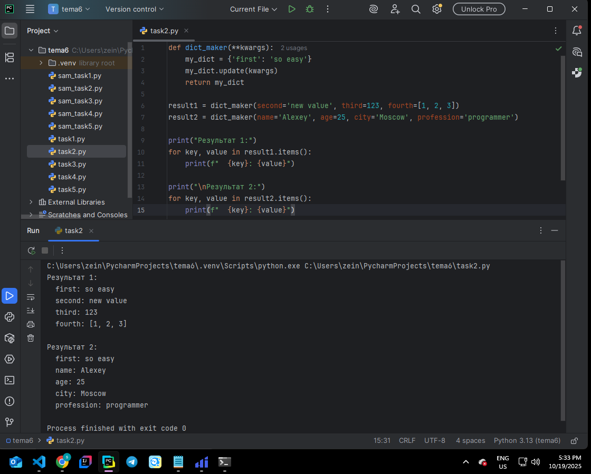  

**Вывод:** Реализовал функцию `dict_maker(**kwargs)`, которая обновляет существующий словарь `my_dict` с помощью переданных аргументов. Использовал модуль `pprint` для красивого вывода.  

---

### Задание 3  
**Скриншот результата:**  
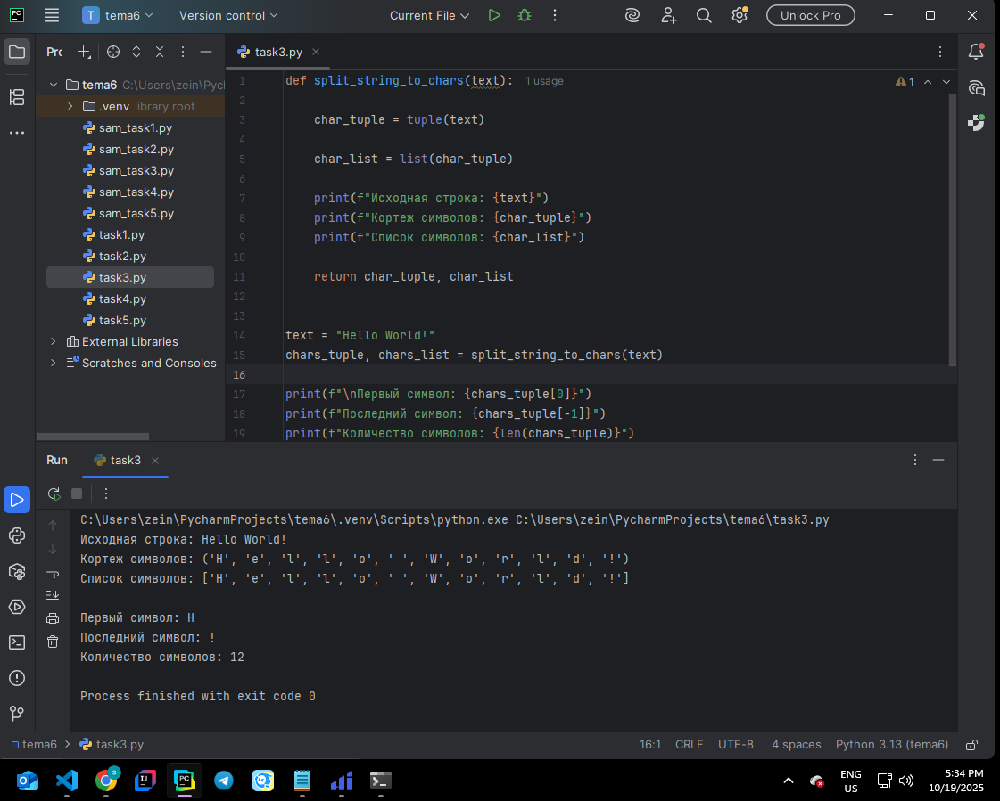  

**Вывод:** Разбил строку на отдельные символы, преобразовал её в кортеж и далее при необходимости в список.  

---

### Задание 4  
**Скриншот результата:**  
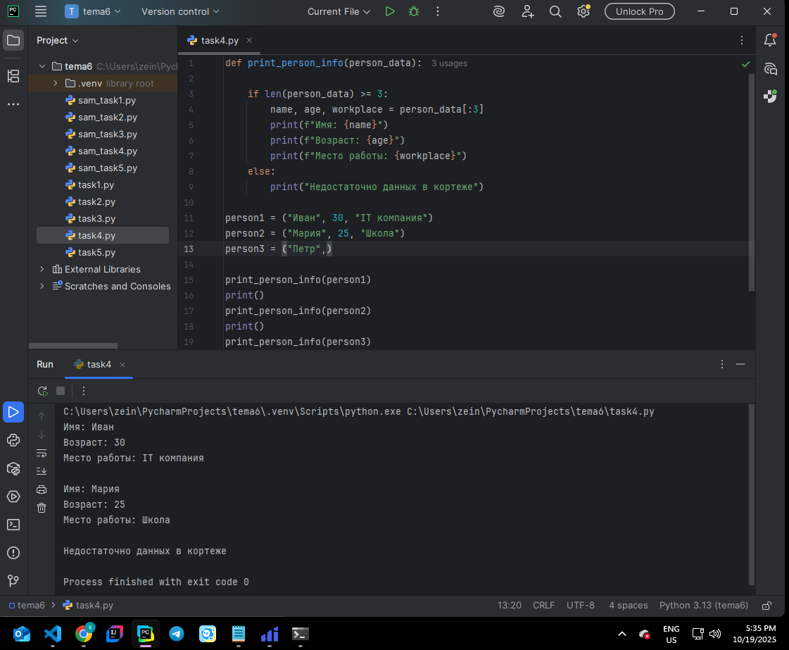  

**Вывод:** Написал функцию, принимающую кортеж с именем, возрастом и местом работы и выводящую их в удобном формате.  

---

### Задание 5  
**Скриншот результата:**  
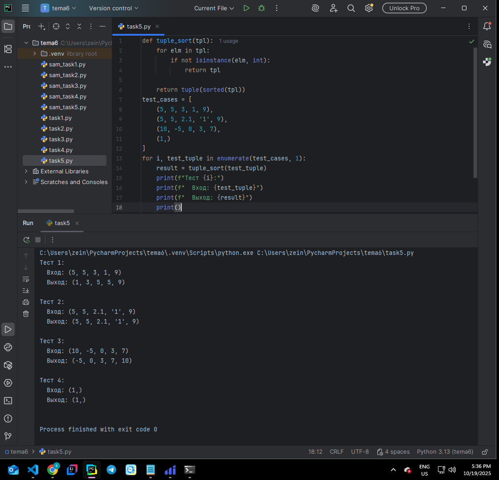  

**Вывод:** Создал функцию, которая сортирует кортеж с целыми числами по возрастанию и возвращает новый кортеж. Если встречаются нечисловые элементы, возвращается исходный.  

---

## 📗 Самостоятельная работа 6  

### Задание 1  
**Скриншот результата:**  
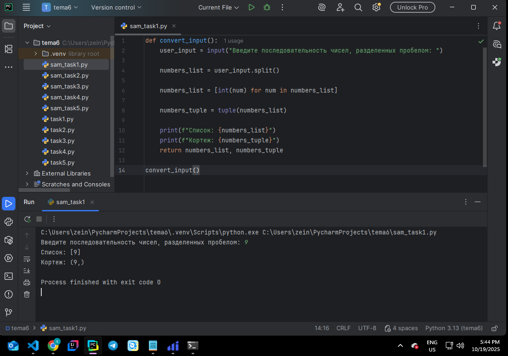  

**Вывод:** Получил от пользователя строку чисел, преобразовал её в список и кортеж с использованием `input()`.  

---

### Задание 2  
**Скриншот результата:**  
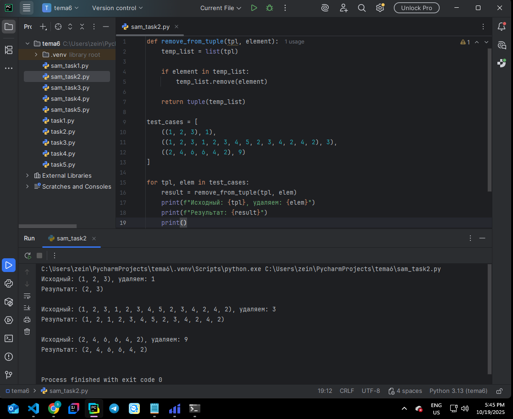  

**Вывод:** Реализовал функцию для удаления первого вхождения элемента из кортежа с возвратом нового кортежа. При отсутствии значения возвращается исходный.  

---

### Задание 3  
**Скриншот результата:**  
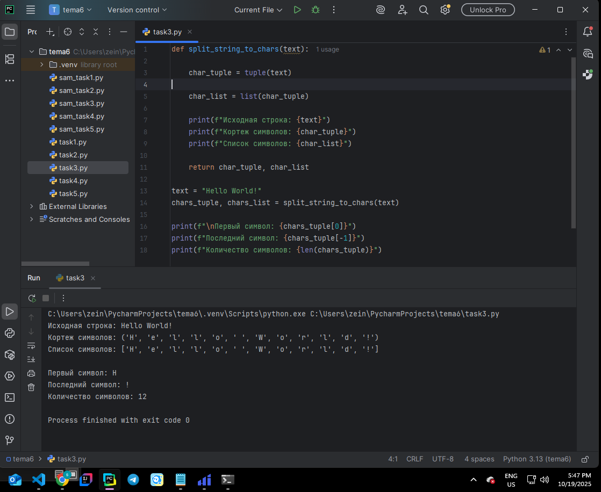  

**Вывод:** Создал функцию, принимающую строку цифр и возвращающую словарь с количеством вхождений чисел. Из словаря вывел топ-3 самых часто встречающихся чисел в порядке возрастания ключей.  

---

### Задание 4  
**Скриншот результата:**  
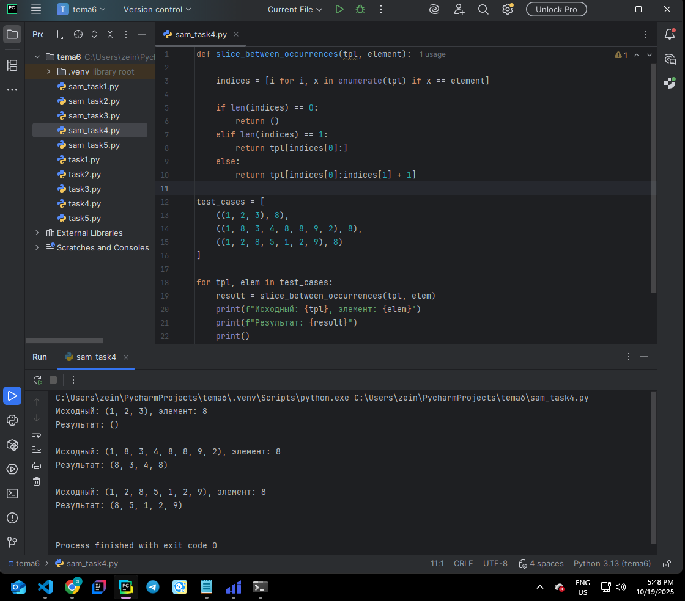  

**Вывод:** Написал функцию, которая принимает кортеж и ID элемента, возвращает новый кортеж от первого до второго вхождения элемента (включительно), или пустой, если элемент отсутствует.  

---

### Задание 5  
**Скриншот результата:**  
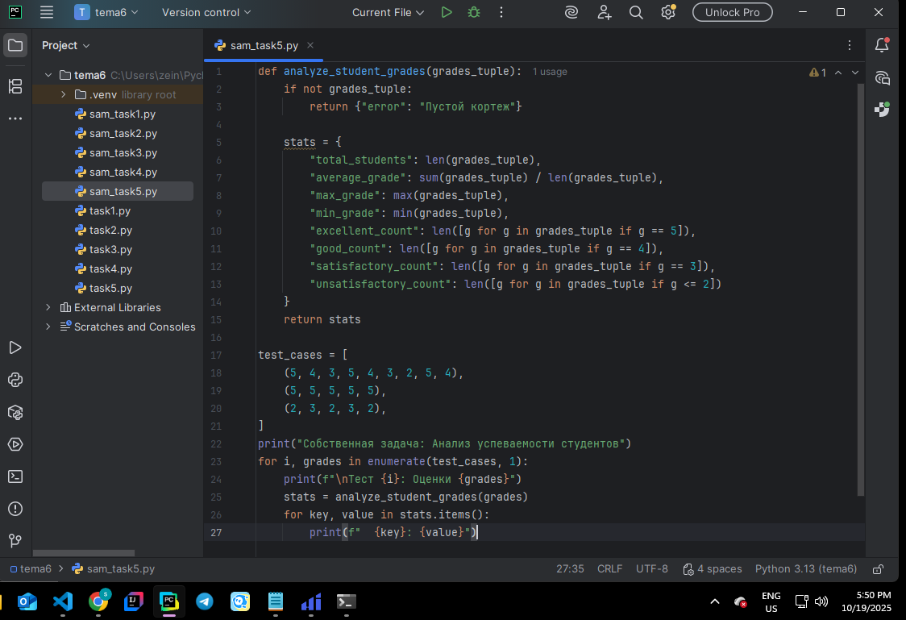  
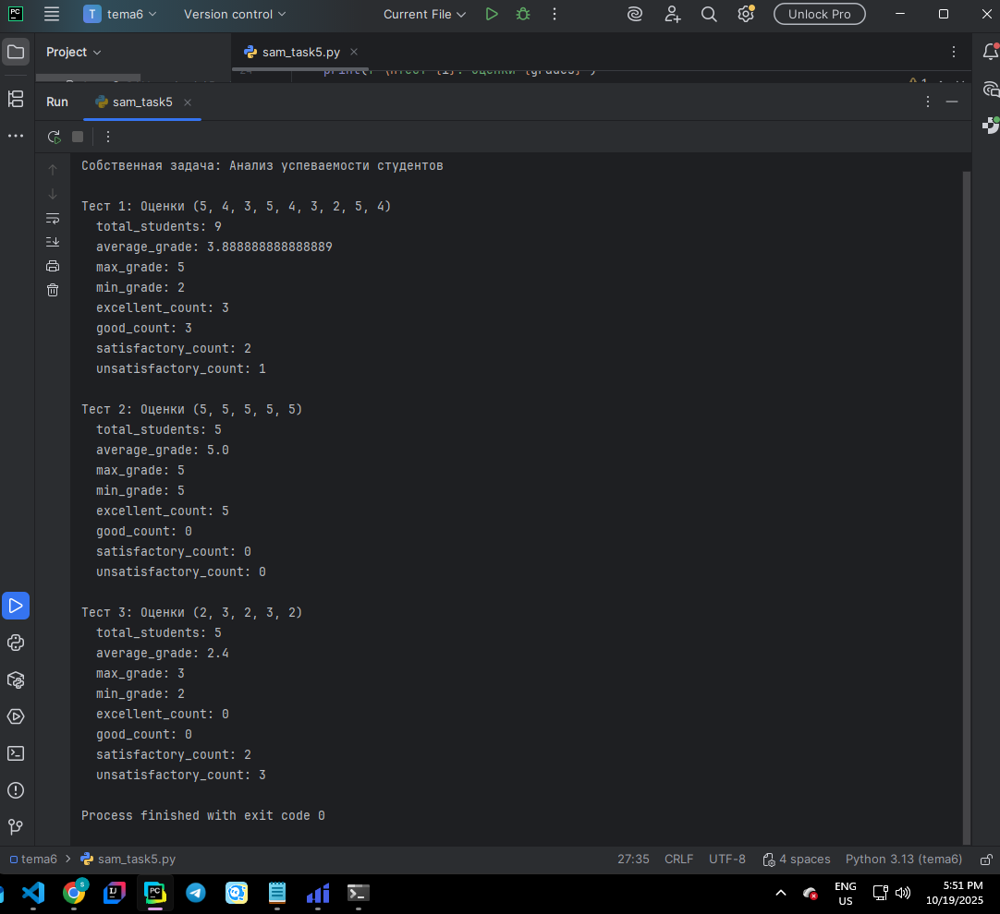 

**Вывод:** Придумал собственную задачу с использованием кортежей и списков, провёл минимум три теста для проверки работоспособности программы.  

---

## Общий вывод  

В ходе выполнения лабораторных и самостоятельных заданий по теме 6 я закрепил навыки работы со словари и кортежами в Python. Я научился:  

- создавать и модифицировать словари (`dict`) с помощью аргументов `**kwargs`;  
- использовать кортежи (`tuple`) для хранения и обработки данных;  
- выполнять преобразования между строками, списками и кортежами;  
- реализовывать функции для поиска, сортировки и обработки данных в коллекциях;  
- применять словари вместо громоздких условных операторов;  
- анализировать и структурировать данные в гибкой форме.  

Эта тема помогла освоить основы работы со словарями и кортежами, что является важным шагом в изучении структур данных Python.  
