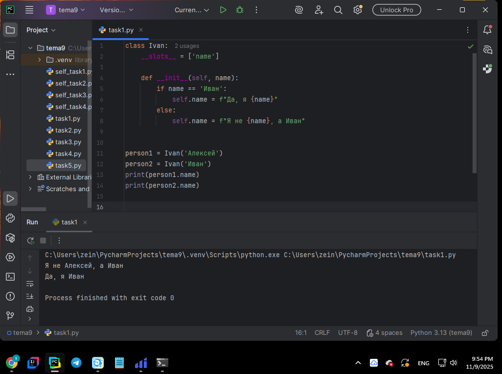
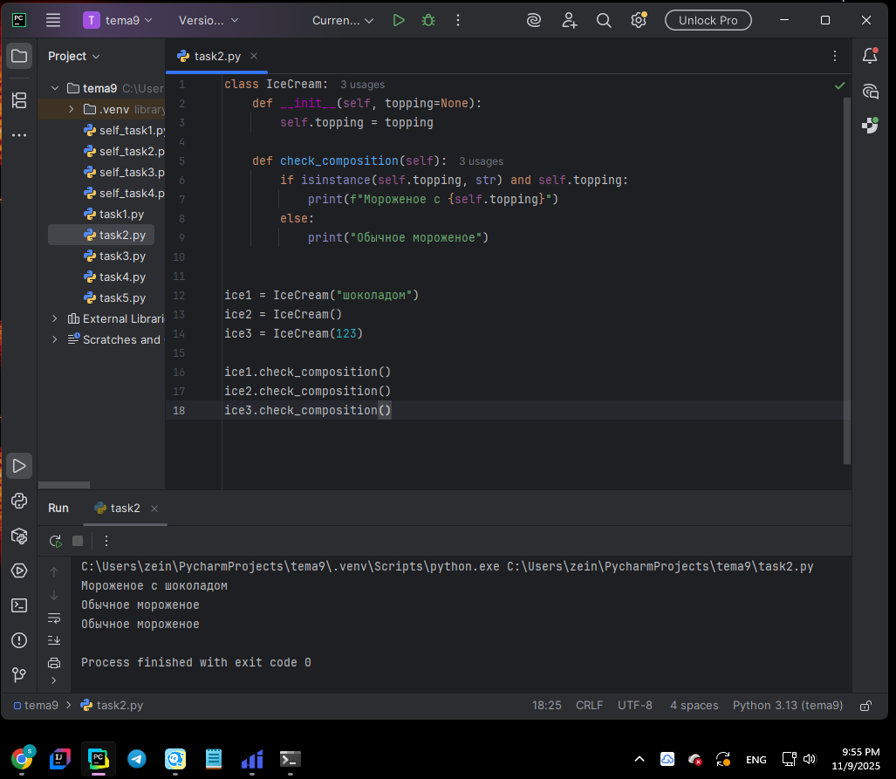
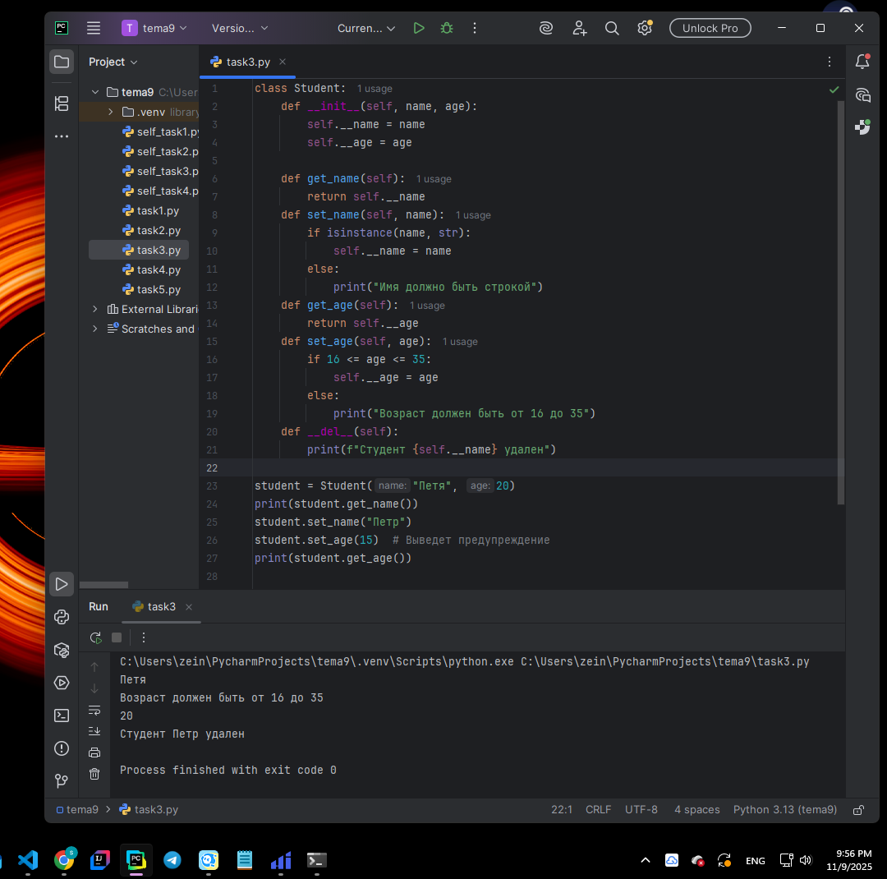
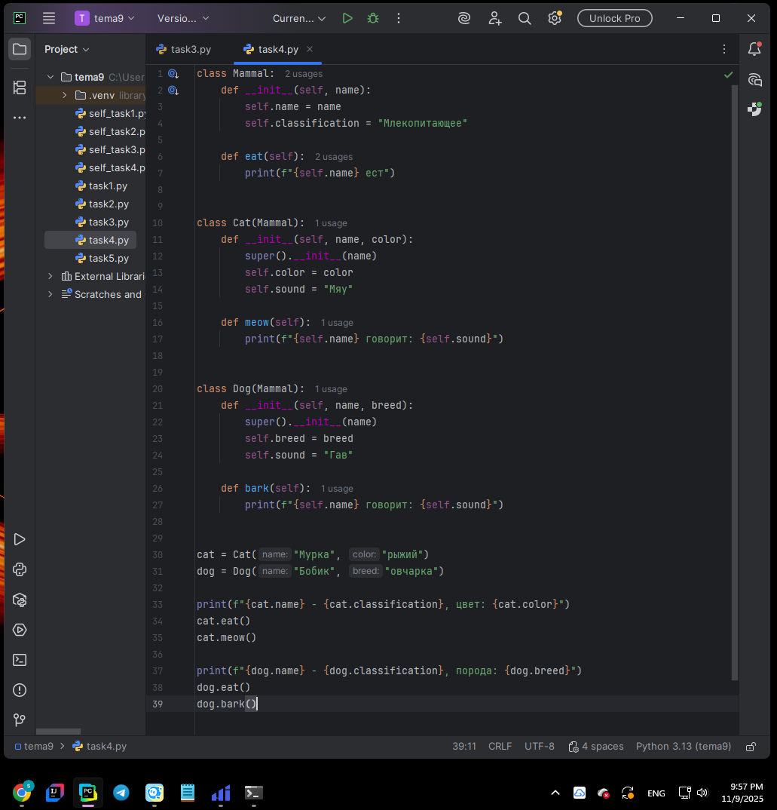
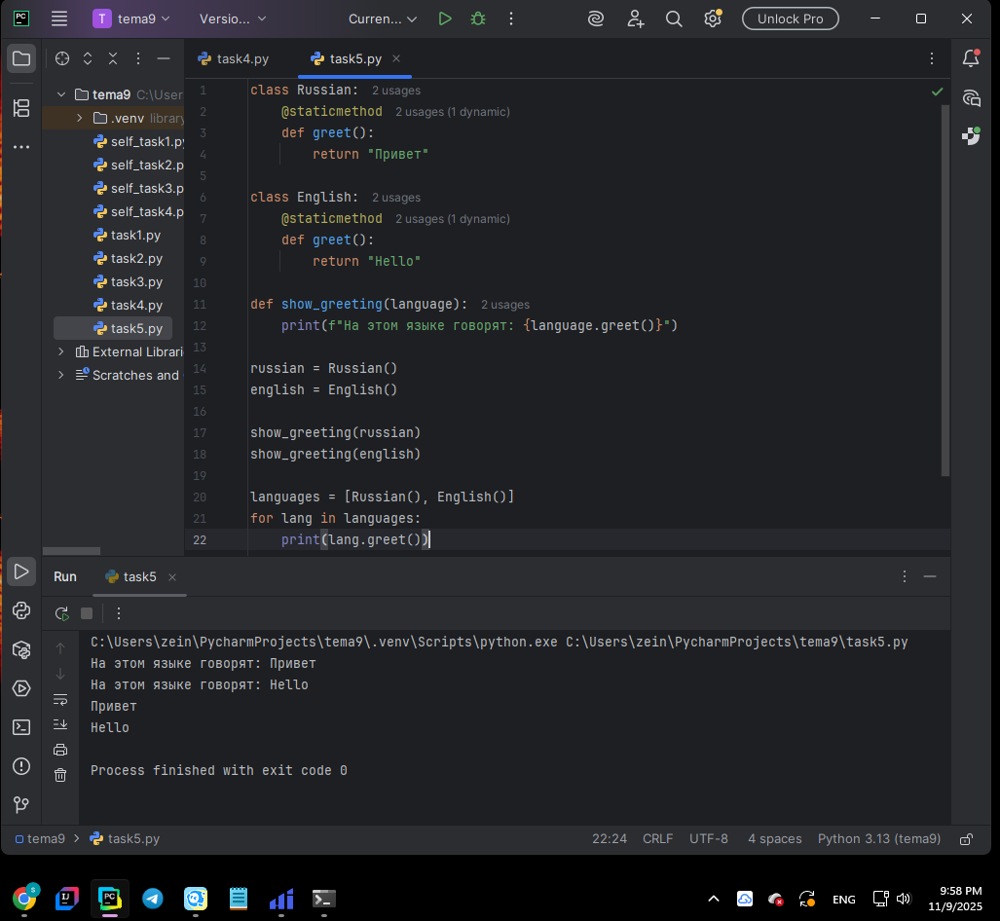
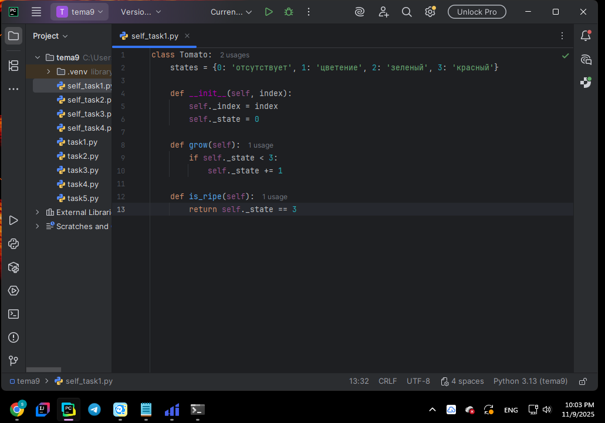
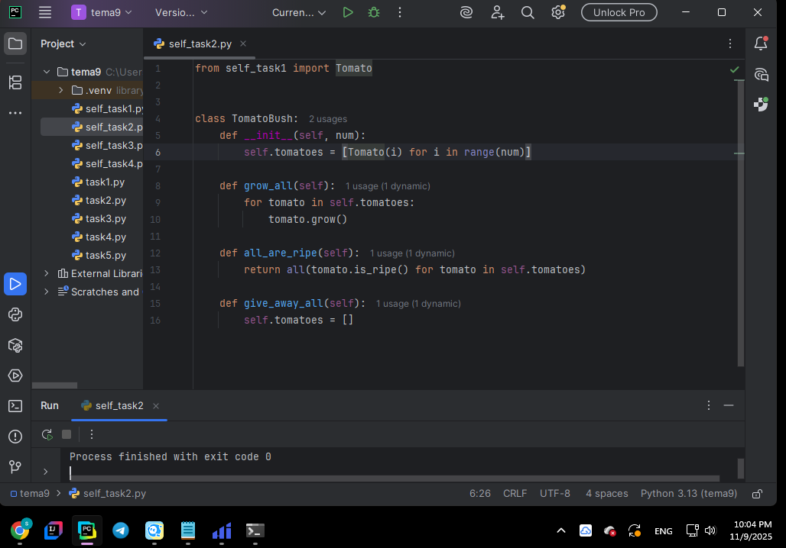
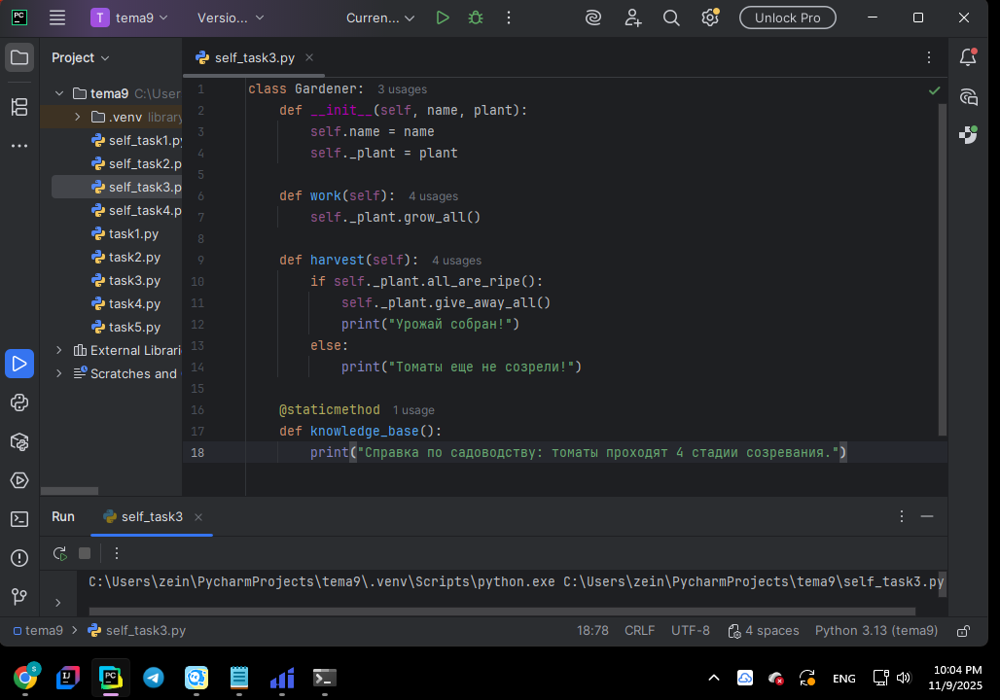
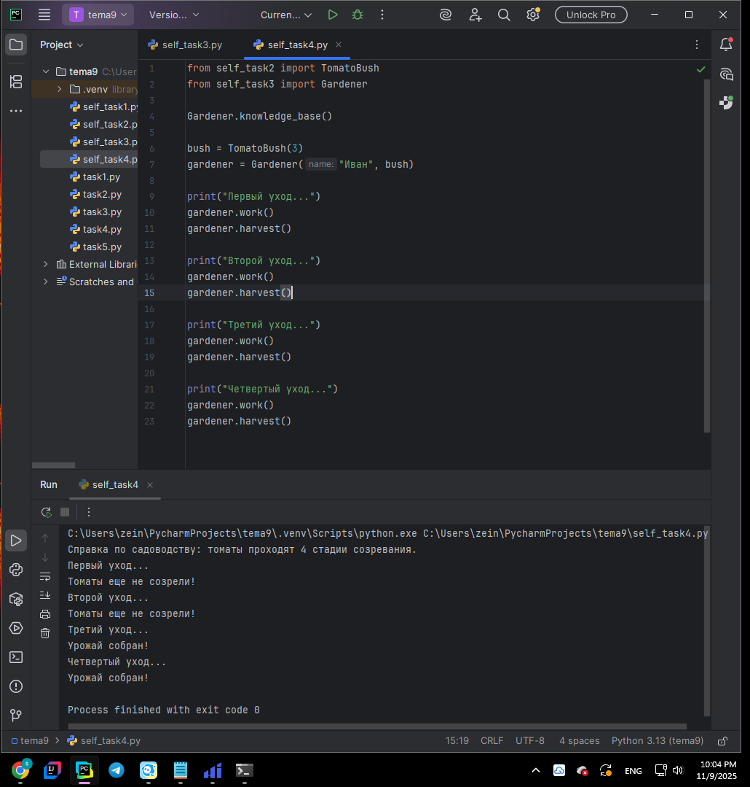

# Тема 9. Концепции и принципы ООП  
**ФИО:** Зейн Талеб Шейхна  
**Группа:** ИВТ-23-1  

## Итоговая таблица  

| Задание   | Лаб_раб | Сам_раб |
|-----------|:-------:|:-------:|
| Задание 1 |    +    |    +    |
| Задание 2 |    +    |    +    |
| Задание 3 |    +    |    +    |
| Задание 4 |    +    |    +    |
| Задание 5 |    +    |    -    |

Знак «+» – задание выполнено; знак «–» – задание не выполнено.  

---

# 📘 Лабораторная работа 9  

### Задание 1: Проверка имени  
**Скриншот:**   
**Вывод:** Создал класс `Ivan` с использованием `__slots__`, который проверяет совпадение введённого имени с `"Иван"`.  
При несовпадении выводится сообщение об ошибке. Продемонстрирована работа с ограничением атрибутов через `__slots__`.  

---

### Задание 2: Мороженое с топпингом  
**Скриншот:**   
**Вывод:** Реализовал класс `IceCream`, который проверяет наличие и тип топпинга.  
Если топпинг является строкой — выводится сообщение о мороженом с добавкой, иначе — об обычном мороженом.  

---

### Задание 3: Инкапсуляция с сеттером и геттером  
**Скриншот:**   
**Вывод:** Создал класс `Student` с приватными атрибутами `__name` и `__age`.  
Реализовал методы `getter` и `setter` для управления доступом к данным, а также деструктор, который сообщает об удалении объекта.  

---

### Задание 4: Наследование кошек и собак  
**Скриншот:**   
**Вывод:** Продемонстрировал наследование — создал базовый класс `Mammal` и дочерние классы `Cat` и `Dog`.  
Каждый класс имеет уникальные атрибуты и методы, показывая различия между животными.  

---

### Задание 5: Полиморфизм приветствий  
**Скриншот:**   
**Вывод:** Реализовал классы `Russian` и `English` со статическими методами `greet()`.  
Показал полиморфизм через единый интерфейс вызова метода для разных языков.  

---

# 📗 Самостоятельная работа 9  

### Задание 1: Класс Tomato  
**Скриншот:**   
**Вывод:** Создал класс `Tomato` с атрибутами индекса и стадии созревания.  
Реализовал методы для роста томата и проверки его зрелости.  

---

### Задание 2: Класс TomatoBush  
**Скриншот:**   
**Вывод:** Написал класс `TomatoBush`, который содержит список томатов.  
Реализовал методы для роста всех томатов, проверки их зрелости и сбора урожая.  

---

### Задание 3: Класс Gardener  
**Скриншот:**   
**Вывод:** Создал класс `Gardener` с методами для ухода за растениями и сбора урожая.  
Добавил статический метод для вывода справки по садоводству.  

---

### Задание 4: Тестирование системы  
**Скриншот:**   
**Вывод:** Протестировал взаимодействие всех классов: создал объекты, продемонстрировал рост томатов через несколько циклов ухода,  
проверку зрелости и финальный сбор урожая. Программа показывает полный жизненный цикл томатов от посадки до сбора.  

---

## Общий вывод  

В ходе выполнения лабораторных и самостоятельных заданий по теме 9 я освоил основные концепции объектно-ориентированного программирования:  
- применение инкапсуляции, наследования и полиморфизма;  
- использование `__slots__` для оптимизации классов;  
- создание и использование геттеров, сеттеров и деструкторов;  
- реализацию взаимодействия объектов между собой;  
- применение статических методов и единого интерфейса вызова.  

Данная тема закрепила ключевые принципы ООП и помогла понять, как строятся классы и объекты в Python.  
