# Тема 5. Коллекции, множества и списки  
**ФИО:** Зейн Талеб Шейхна  
**Группа:** ИВТ-23-1  

## Итоговая таблица  

| Задание   | Лаб_раб | Сам_раб |
|-----------|:-------:|:-------:|
| Задание 1 |    +    |    +    |
| Задание 2 |    +    |    +    |
| Задание 3 |    +    |    +    |
| Задание 4 |    +    |    +    |
| Задание 5 |    +    |    +    |
| Задание 6 |    +    |    -    |
| Задание 7 |    +    |    -    |
| Задание 8 |    +    |    -    |
| Задание 9 |    +    |    -    |
| Задание 10|    +    |    -    |

Знак "+" – задание выполнено; знак "-" – задание не выполнено.  

# Лабораторная работа 5 и Самостоятельная работа 5  

## 📘 Лабораторная работа 5  

### Задание 1  
**Скриншот результата:**  
  

**Вывод:** Определил элементы, присутствующие только в одном множестве, используя операции разности и симметрической разности множеств.  

---

### Задание 2  
**Скриншот результата:**  
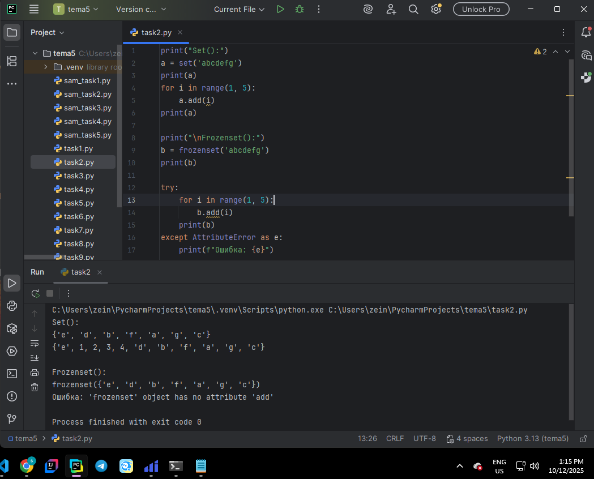  

**Вывод:** Сравнил поведение `set()` и `frozenset()`, показав, что `frozenset` является неизменяемым множеством.  

---

### Задание 3  
**Скриншот результата:**  
  

**Вывод:** Реализовал программу, меняющую местами первый и последний элементы списка.  

---

### Задание 4  
**Скриншот результата:**  
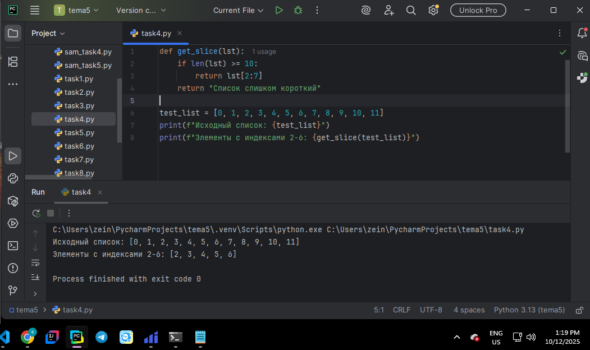  

**Вывод:** Использовал срезы для вывода элементов списка с индекса 2 по 6 включительно.  

---

### Задание 5  
**Скриншот результата:**  
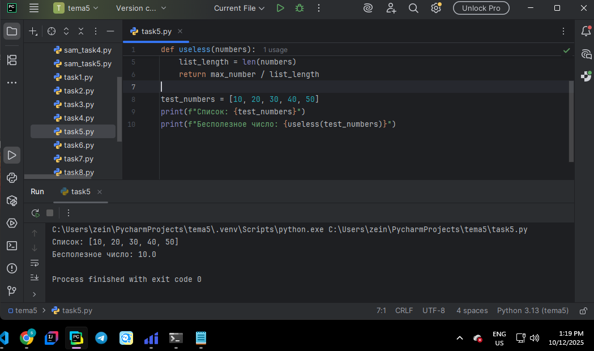  

**Вывод:** Написал функцию `useless()`, которая делит максимальный элемент списка на длину списка.  

---

### Задание 6  
**Скриншот результата:**  
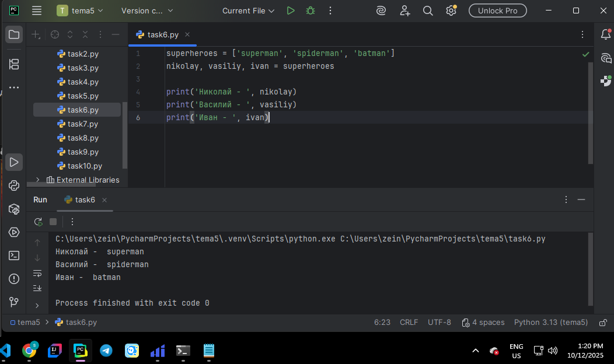  

**Вывод:** Разделил общий список супергероев на отдельные подсписки с помощью срезов и распределил их по командам.  

---

### Задание 7  
**Скриншот результата:**  
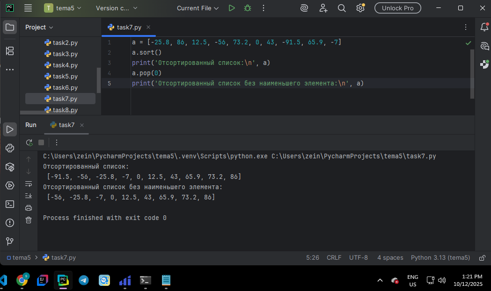  

**Вывод:** Определил наименьший элемент списка, удалил его и вывел обновлённый список.  

---

### Задание 8  
**Скриншот результата:**  
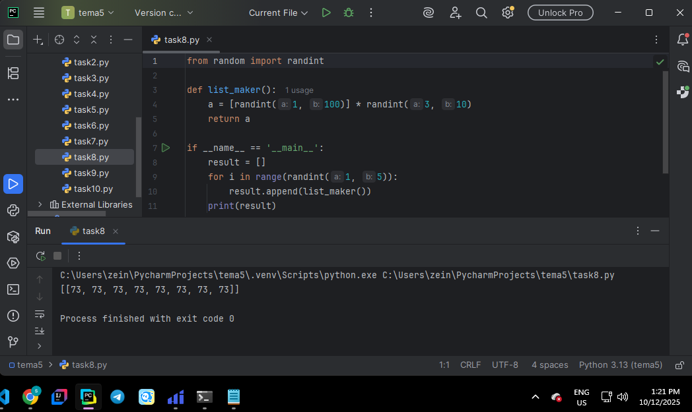  

**Вывод:** Создал список, состоящий из нескольких случайных подсписков, используя генераторы списков и модуль `random`.  

---

### Задание 9  
**Скриншот результата:**  
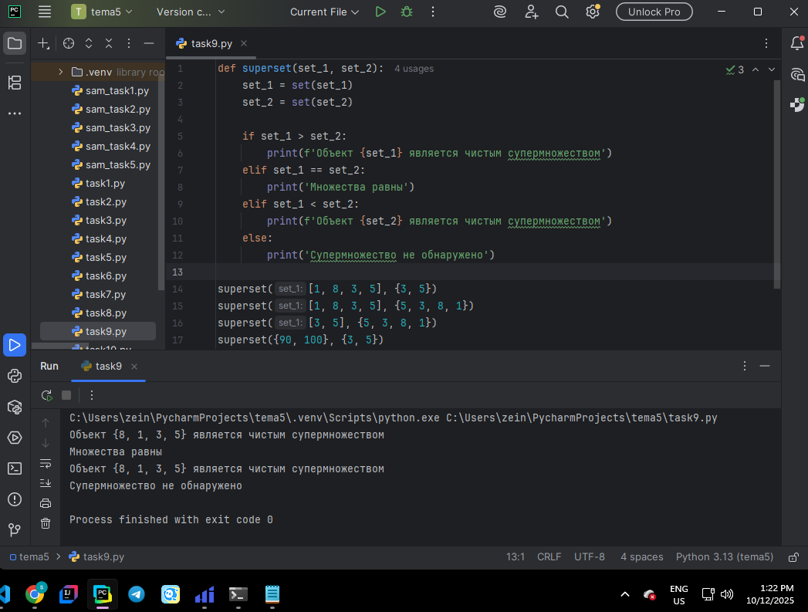  

**Вывод:** Написал функцию `superset()`, которая проверяет, является ли одно множество надмножеством другого.  

---

### Задание 10  
**Скриншот результата:**  
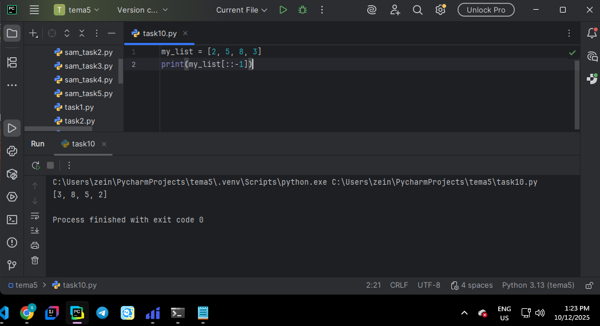  

**Вывод:** Развернул список в обратном порядке при помощи встроенных методов Python в две строки кода.  

---

## 📗 Самостоятельная работа 5  

### Задание 1  
**Скриншот результата:**  
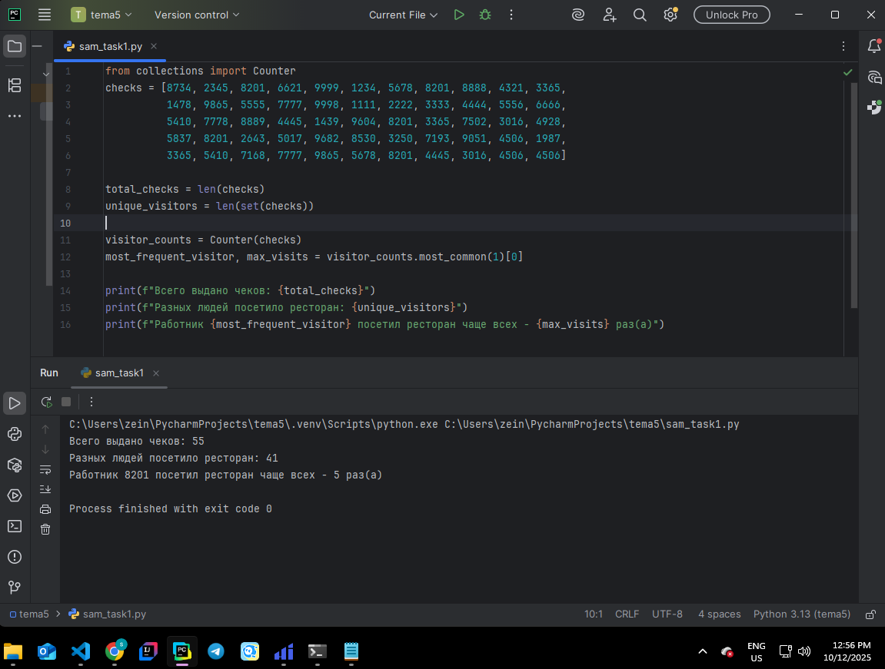  

**Вывод:** Подсчитал количество чеков, уникальных сотрудников и определил самого частого посетителя, используя множества и словари.  

---

### Задание 2  
**Скриншот результата:**  
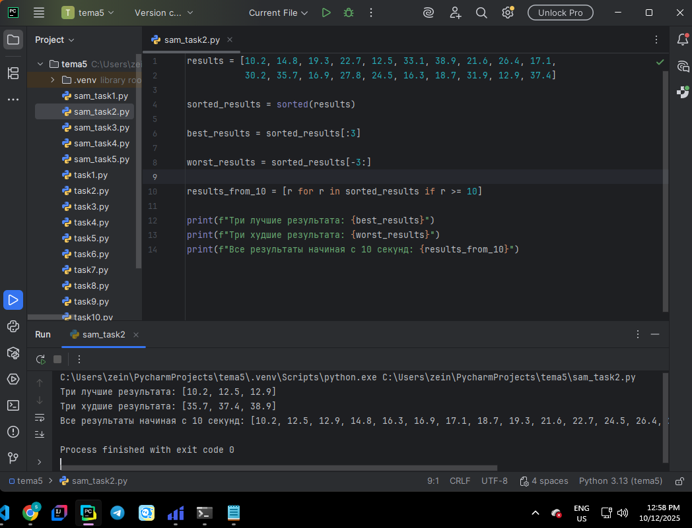  

**Вывод:** Определил три лучших и три худших результата гонки, а также вывел результаты начиная с десятого индекса.  

---

### Задание 3  
**Скриншот результата:**  
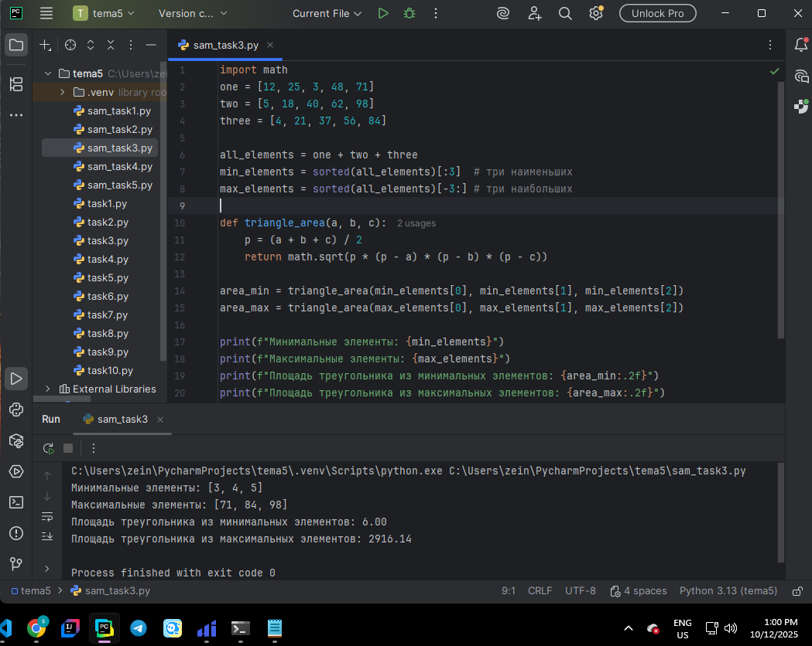  

**Вывод:** Рассчитал площади двух треугольников — один из наименьших, другой из наибольших элементов списков.  

---

### Задание 4  
**Скриншот результата:**  
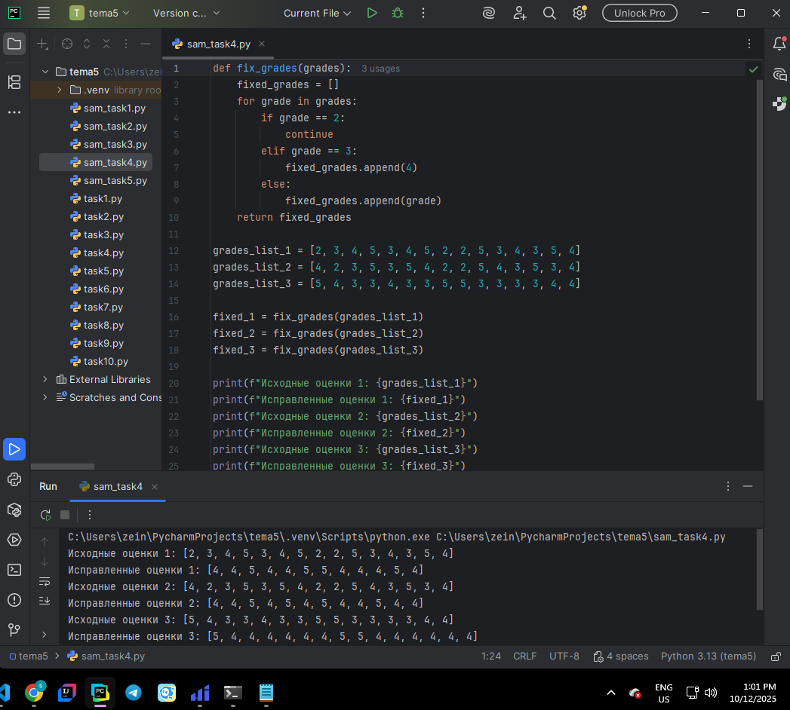  

**Вывод:** Для трёх списков удалил все элементы «2» и заменил все «3» на «4».  

---

### Задание 5  
**Скриншот результата:**  
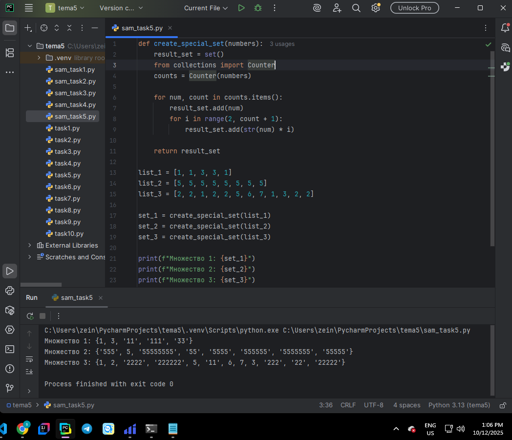  

**Вывод:** Преобразовал списки в множества и добавил повторяющиеся строки (`'44'`, `'444'` и т.д.) для дубликатов.  

---

## Общий вывод  

В ходе выполнения лабораторных и самостоятельных заданий по теме 5 я освоил работу со списками и множествами в Python. Я научился:  

- выполнять операции над множествами (объединение, пересечение, разность);  
- различать изменяемые (`set`) и неизменяемые (`frozenset`) коллекции;  
- использовать срезы и индексы для работы со списками;  
- создавать вложенные списки и обращаться к ним;  
- применять функции, генераторы и условия для обработки коллекций;  
- комбинировать множества, списки и словари для анализа данных.  

Эти задания помогли закрепить понимание структуры данных и научили эффективно использовать коллекции Python в практических задачах.  
