# Тема 4. Функции, аргументы, модули  
**ФИО:** Зейн Талеб Шейхна  
**Группа:** ИВТ-23-1  

## Итоговая таблица  

| Задание   | Лаб_раб | Сам_раб |
|-----------|:-------:|:-------:|
| Задание 1 |    +    |    +    |
| Задание 2 |    +    |    +    |
| Задание 3 |    +    |    +    |
| Задание 4 |    +    |    +    |
| Задание 5 |    +    |    +    |
| Задание 6 |    +    |    -    |
| Задание 7 |    +    |    -    |
| Задание 8 |    +    |    -    |
| Задание 9 |    +    |    -    |
| Задание 10|    +    |    -    |

Знак "+" – задание выполнено; знак "-" – задание не выполнено.  

# Лабораторная работа 4 и Самостоятельная работа 4  

## 📘 Лабораторная работа 4  

### Задание 1  
**Скриншот результата:**  
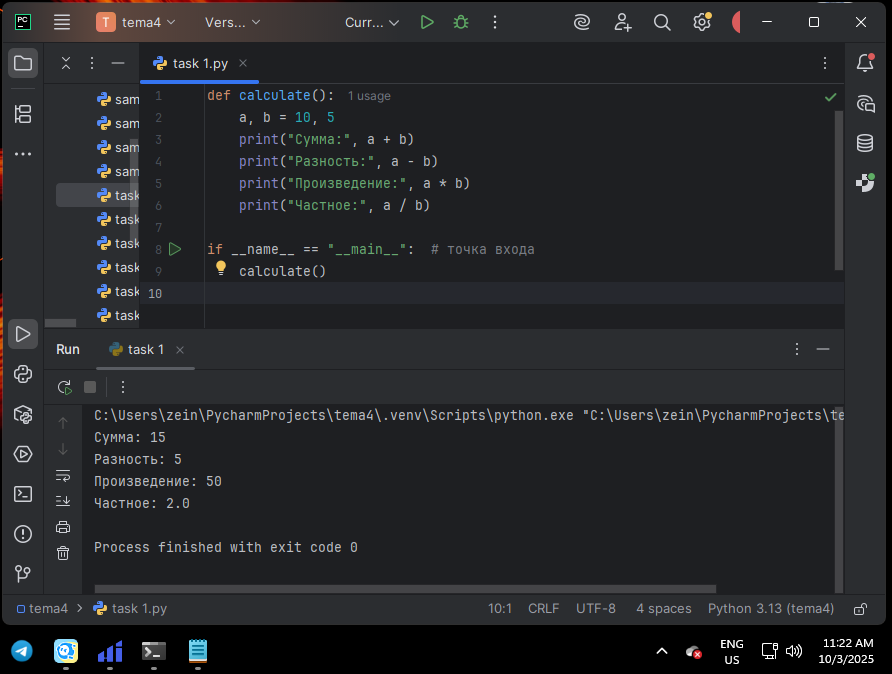  

**Вывод:** Написал функцию для выполнения арифметических действий и вызвал её через точку входа.  

---

### Задание 2  
**Скриншот результата:**  
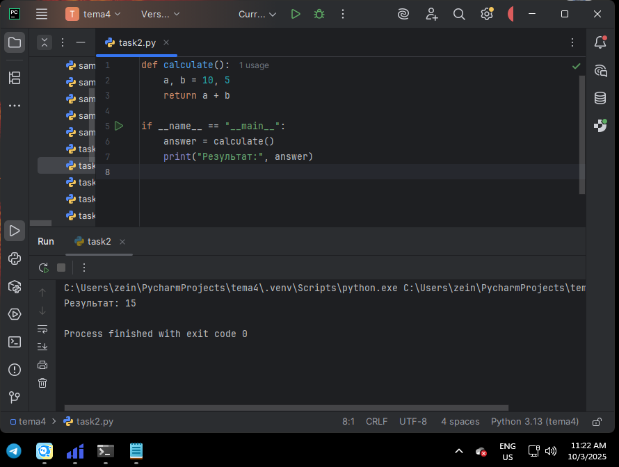  

**Вывод:** Использовал функцию с `return` для возврата результата и сохранил его в переменную `answer`.  

---

### Задание 3  
**Скриншот результата:**  
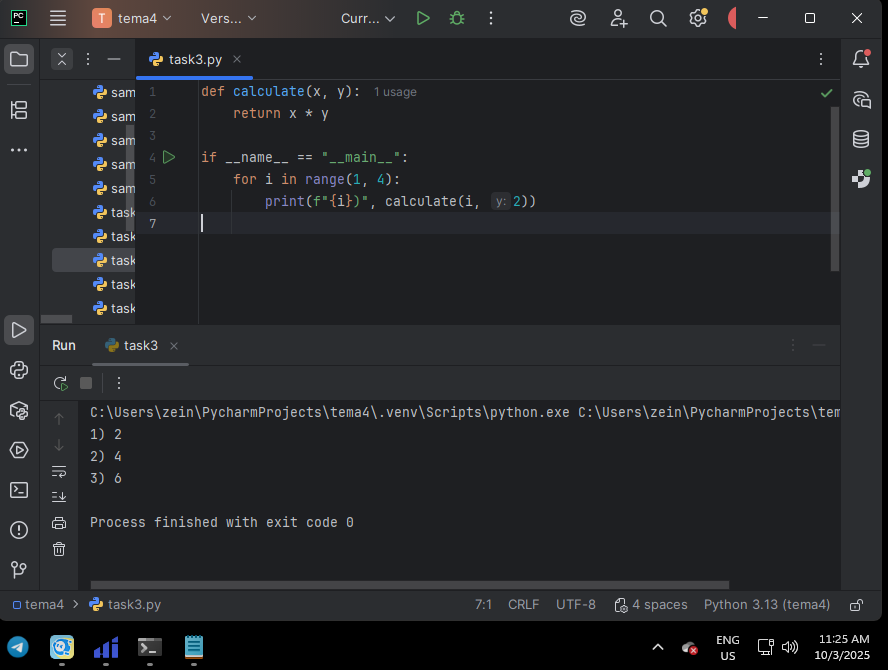  

**Вывод:** Передал аргументы в функцию, выполнял вычисления в цикле и выводил результаты.  

---

### Задание 4  
**Скриншот результата:**  
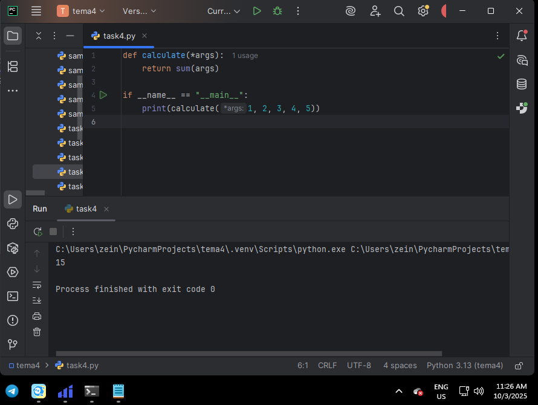  

**Вывод:** Использовал `*args` для передачи неизвестного количества аргументов и выполнил арифметическое действие.  

---

### Задание 5  
**Скриншот результата:**  
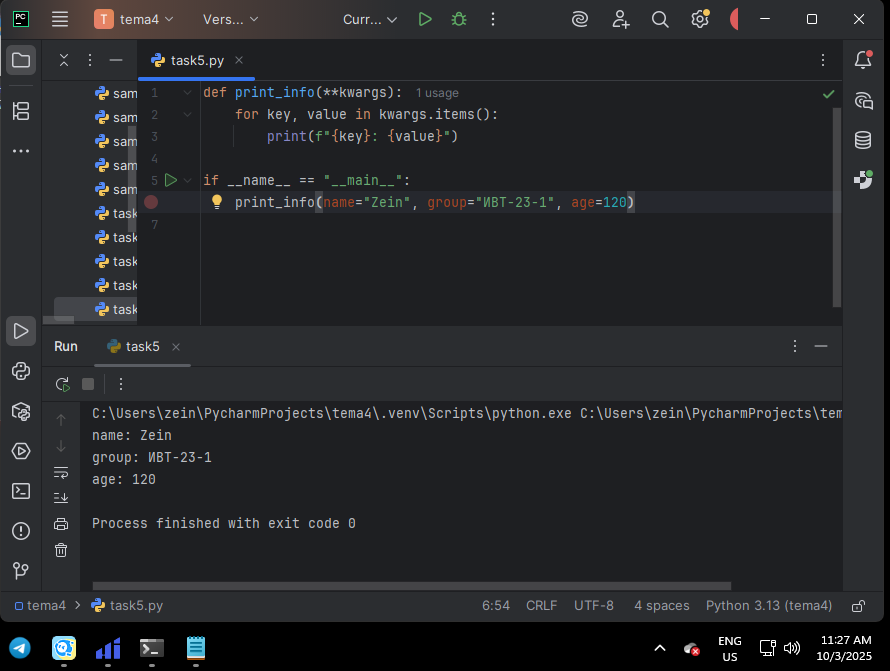  

**Вывод:** Создал функцию с `**kwargs` и с помощью цикла вывел переданные значения.  

---

### Задание 6  
**Скриншот результата:**  
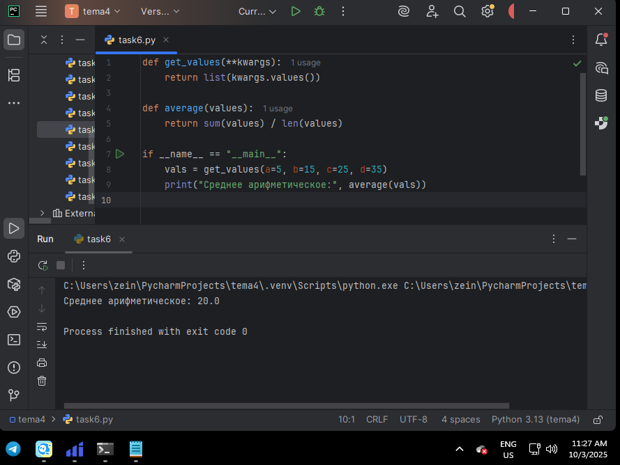  

**Вывод:** Реализовал две функции: одна возвращает значения `**kwargs`, другая считает их среднее арифметическое.  

---

### Задание 7  
**Скриншот результата:**  
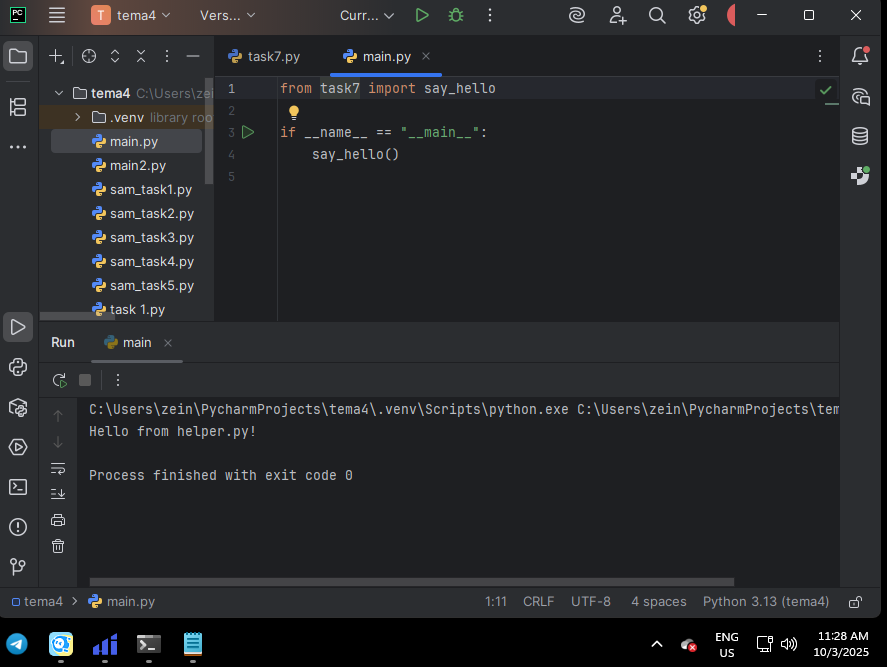  
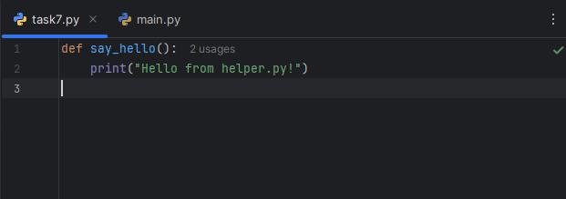 
**Вывод:** Создал отдельный файл с функцией, импортировал её в основной модуль и вызвал через точку входа.  

---

### Задание 8  
**Скриншот результата:**  
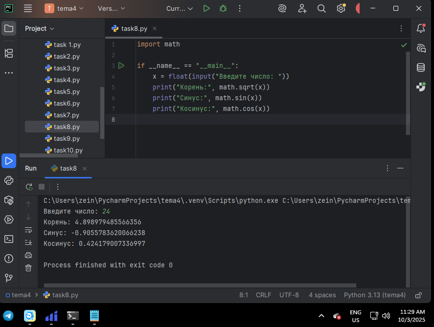  

**Вывод:** Использовал модуль `math` для нахождения корня, синуса и косинуса числа.  

---

### Задание 9  
**Скриншот результата:**  
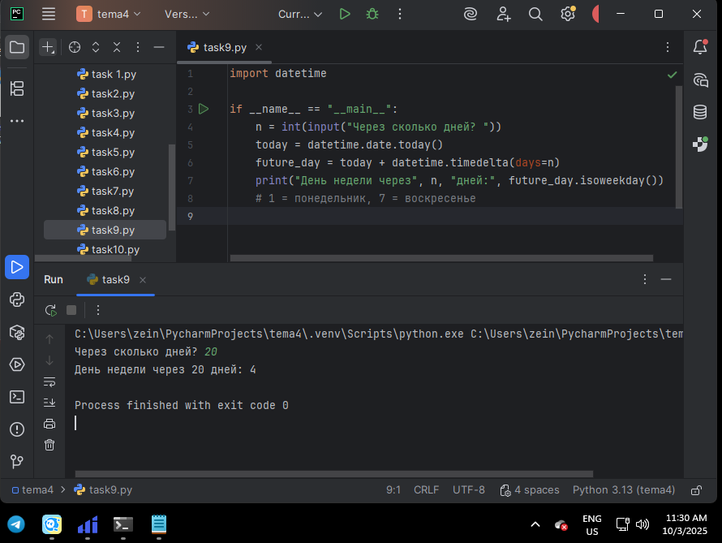  

**Вывод:** Рассчитал, какой день недели будет через заданное пользователем количество дней.  

---

### Задание 10  
**Скриншот результата:**  
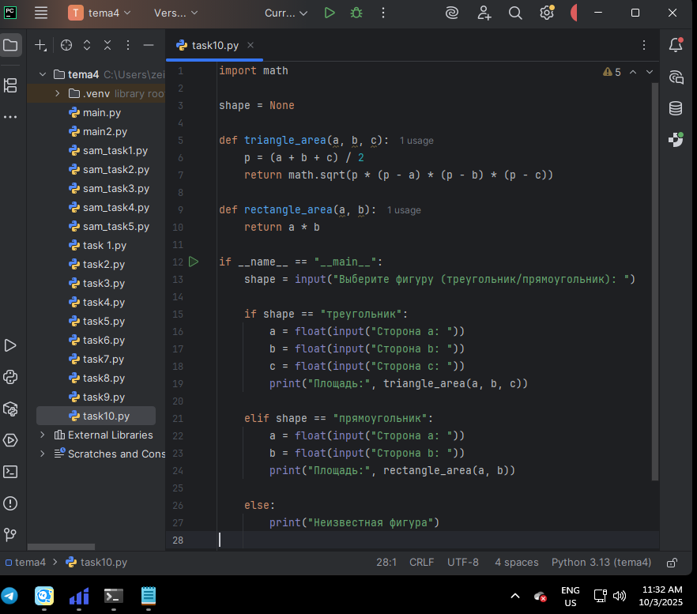  
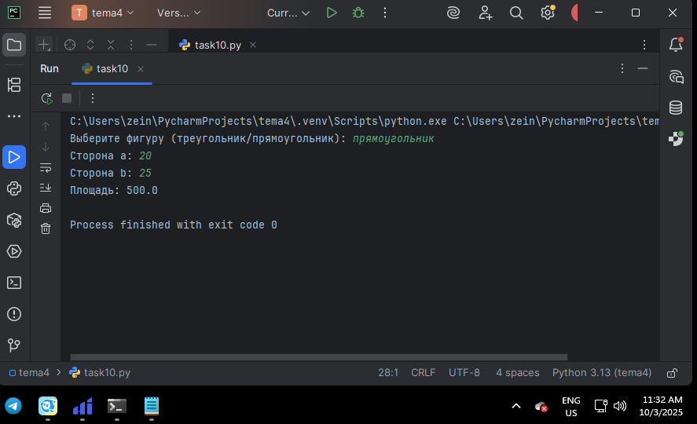  

**Вывод:** Использовал глобальные переменные и написал функции для подсчёта площади треугольника и прямоугольника.  

---

## 📗 Самостоятельная работа 4  

### Задание 1  
**Скриншот результата:**  
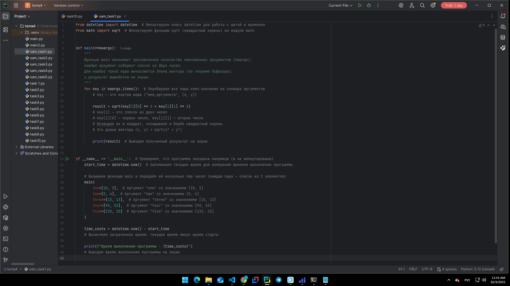  

**Вывод:** Прокомментировал предложенный код, пояснив его работу.  

---

### Задание 2  
**Скриншот результата:**  
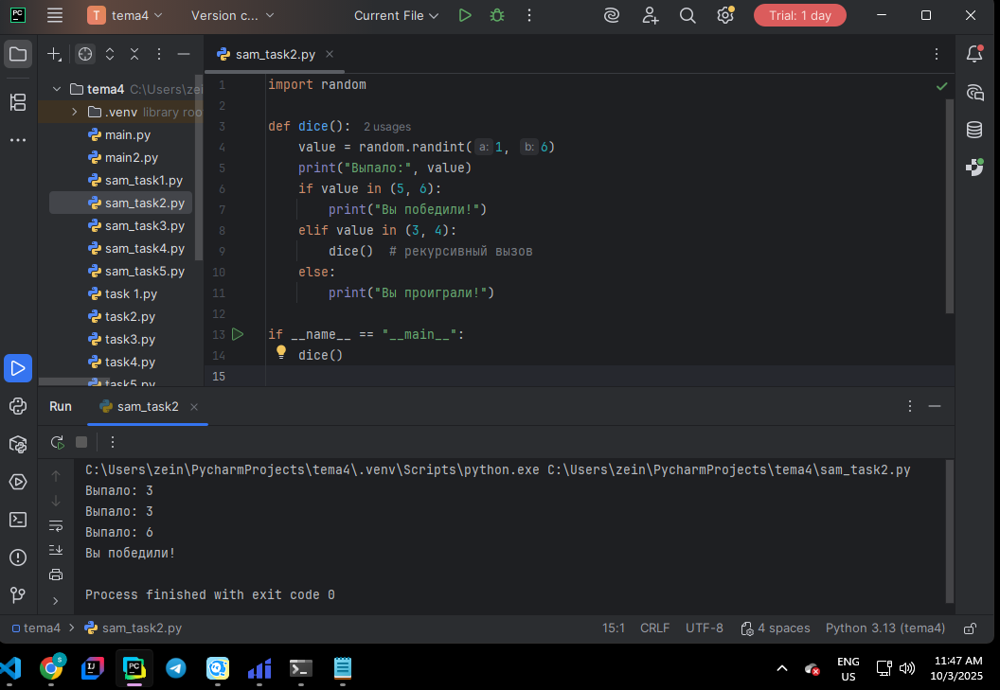  

**Вывод:** С помощью рекурсии реализовал бросок кубика до выпадения шести.  

---

### Задание 3  
**Скриншот результата:**  
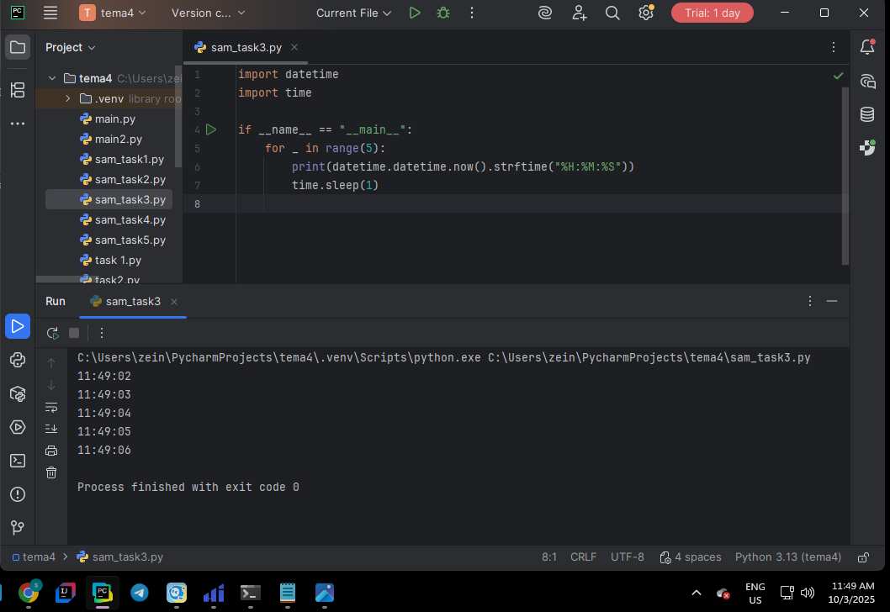  

**Вывод:** Написал программу, которая выводит текущее время каждую секунду в течение минуты.  

---

### Задание 4  
**Скриншот результата:**  
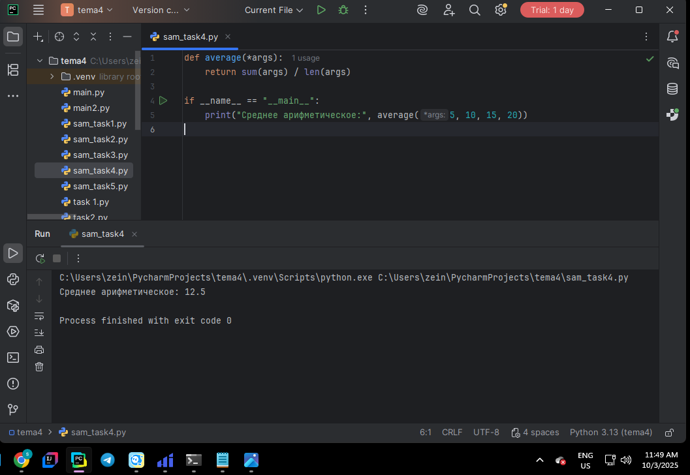  

**Вывод:** Составил функцию, считающую среднее арифметическое из аргументов.  

---

### Задание 5  
**Скриншот результата:**  
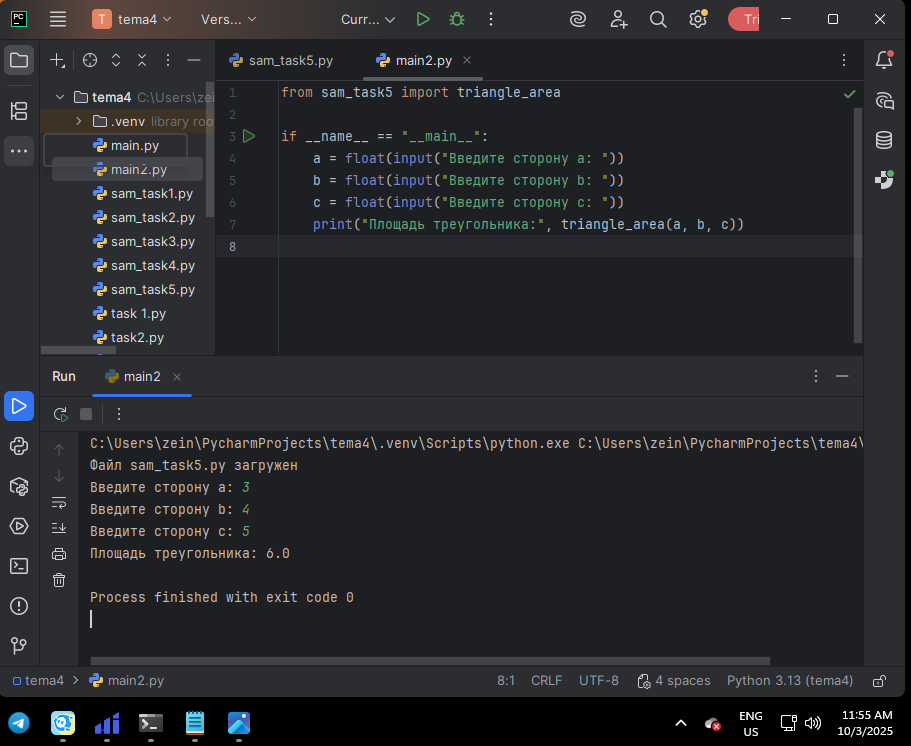  

**Вывод:** Разбил задачу на несколько модулей: в одном реализовал формулу Герона, в другом — вызов и вывод результата.  

---

## Общий вывод  

В ходе выполнения лабораторных и самостоятельных заданий по теме 4 я закрепил навыки работы с функциями и модулями в Python. Я научился:  

- писать функции с параметрами, `return`, `*args` и `**kwargs`;  
- использовать циклы для вызова функций с разными аргументами;  
- создавать и импортировать собственные модули;  
- работать с библиотекой `math`;  
- применять глобальные переменные для расчётов;  
- структурировать программу на несколько файлов.  

Эти задания помогли освоить основы работы с функциями и модулями в Python и подготовили к более сложному программированию.  
